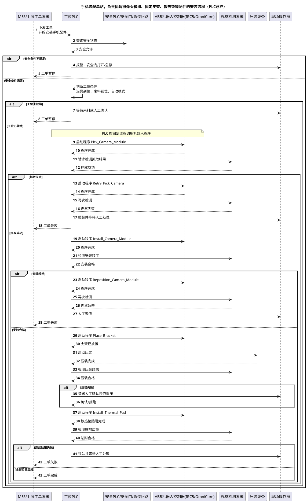

# 第 1 章：为什么 2026 年柔性制造的核心命题正在从自动化转向 AI 能力

摘要：这一章先不讨论工具和产线细节，而是先重定义问题本身，解释为什么消费电子和小型精密电子装配的核心命题正在从自动化转向 AI 能力。

## 名词解释

| 名词 | 说明 |
| --- | --- |
| `ABB` | 工业机器人和自动化系统供应商，文中主要指其机器人执行与工程交付体系。 |
| `SKU` | Stock Keeping Unit，这里可理解为不同产品型号、配置或版本对应的管理单元。 |
| `PLC` | 可编程逻辑控制器，负责现场设备时序、互锁和基础控制逻辑。 |
| `RAPID` | `ABB` 机器人的编程语言，用于定义机器人动作、路径和流程。 |
| `RobotStudio` | `ABB` 的机器人仿真、离线编程与调试平台。 |
| `sim-to-real` | 从仿真环境过渡到真实设备部署与验证的方法链路。 |
| `Agent` | 能基于上下文做任务分解、决策和调用工具的 AI 智能体。 |
| `VLA` | Vision-Language-Action，结合视觉、语言和动作决策的模型范式。 |
| `世界模型` | 用于描述环境状态变化与结果演化规律的模型或系统。 |
| `Omniverse` | `NVIDIA` 的 3D 协作与仿真平台基础，用于承载工业数字场景与工作流。 |
| `Isaac Sim` | `NVIDIA` 面向机器人与具身智能的仿真平台。 |

为了避免讨论过于抽象，这里先把背景讲清楚，我们需要先明确机械臂相关的相邻但是明显不同的方向

- 固定工位的工业机械臂（缺的在一个已经高度结构化、已经有规则和工艺的现场里，让 AI 帮助处理柔性、异常、换型和恢复）
- 移动操作机器人（需要解决我在哪里 / 我要怎么走过去 / 门能不能打开 / 桌子上哪个杯子才是目标 / 我是否会撞到人，缺的是世界）

两者都会用到感知、空间智能、技能、任务规划，但约束、目标、评价方式完全不一样。

| 维度   | 3C 产线机械臂           | 可行走机器人机械臂                                  |
| ---- | ------------------ | ------------------------------------------ |
| 场景   | 手机、电子、精密装配产线       | 仓库、家庭、工厂巡检、开放环境                            |
| 环境   | 固定、结构化、重复          | 半开放、变化、不可预测                                |
| 位置   | 机器人固定在工位           | 机器人需要先移动再操作                                |
| 核心目标 | 高精度、高节拍、高一致性       | 通用性、自主性、适应性                                |
| 精度要求 | ±0.02 mm 甚至更高      | 往往 cm 级即可                                  |
| 主要问题 | 装配、压装、对位、节拍、异常恢复   | 导航、避障、抓取、场景理解                              |
| 控制方式 | PLC + 机器人程序 + 工艺约束 | 世界模型 + 导航 + Manipulation                   |
| 典型公司 | ABB、FANUC、KUKA     | Boston Dynamics、Figure AI、Agility Robotics |
| 更像什么 | “自动化设备”            | “机器人”                                      |

* `ABB` 正在和 `NVIDIA` 把更真实的仿真、合成数据和 sim-to-real 工作流推进到 `RobotStudio`
* 消费电子装配已经是公开重点行业之一
* 我们关心的不是大件搬运，而是更靠近 `手机 / 3C / 小型精密电子装配` 的高精度、高换型、高调试成本场景

所以本文我们展开思考的是 “固定工位的工业机械臂” 的 “柔性制造”，默认场景都更靠近：

* 小件抓取
* 精密装配
* 频繁版本切换
* 多变体导入
* 高价值异常恢复

这一章不从 ABB、PLC、RAPID 或工站结构讲起，而是先回到一个更上层的问题：

**为什么到了 2026 年，消费电子和小型精密电子装配的核心问题已经不再只是“把人工动作自动化”，而开始变成“让系统获得泛化、换型、恢复和协同能力”。**

如果这个问题不先讲清楚，后面的具身智能、Agent、VLA、世界模型、Omniverse、Isaac Sim 都会显得像“先进工具”，而不是“时代要求下的新能力栈”。

## 本章目标

这一章有四个目标：

1. 解释为什么柔性制造的问题结构已经发生变化。
2. 解释传统自动化为什么越来越难单独覆盖这些变化。
3. 解释 AI 为什么开始从辅助工具变成核心能力层。
4. 给整个系列建立一个 AI-first 的起点。

## 1. 柔性制造的核心矛盾已经变了

### 1.1 过去的核心问题是“自动化替代”

在更早的自动化阶段，主问题通常是：

* 人工太慢
* 人工太贵
* 人工一致性不够
* 某个动作适合交给固定设备或机器人执行

在这种语境下，最重要的事情是：

* 把一个稳定工艺做成自动化动作链

只要产品变化不大、工艺窗口稳定、换型频率不高，这套逻辑就能成立。

### 1.2 2026 年的核心问题开始变成“变化如何被吸收”

但到了 2026 年，尤其在消费电子和小型精密电子装配里，很多场景的压力已经从“是否自动化”转向：

* SKU 更碎
* 版本切换更快
* 来料波动更大
* 异常种类更多
* 产线协作更复杂
* 人工经验越来越难规模化复制

如果把这个压力放到手机和 3C 装配语境里，会更具体：

* 同一条线需要吸收更多变体和小改款
* 小型金属件、柔性件、装饰件的抓取与装配窗口更窄
* 微小偏差就可能导致良率、节拍和返工成本明显上升
* 新版本导入和工艺调试越来越不能完全依赖资深工程师现场记忆

这意味着系统真正要解决的问题开始变成：

* 变化来了以后，系统能否快速理解
* 变化来了以后，系统能否保持任务连续性
* 异常出现以后，系统能否快速恢复
* 新机种导入时，系统能否复用已有能力

也就是说，柔性制造的核心开始从：

* `动作自动化`

转向：

* `能力泛化`
* `快速换型`
* `异常恢复`
* `多模块协同`

### 1.3 这不是“更智能一点”，而是问题范式发生了变化

如果继续用传统自动化视角去看，这种变化很容易被误解成：

* 只是规则做得更复杂一点
* 只是视觉模块更强一点
* 只是上位机调度更聪明一点

但更准确的说法是：

* 系统开始需要具备面向变化的理解、组合和恢复能力

而这种能力，正是 AI 重要性迅速上升的原因。

## 2. 传统自动化为什么越来越难单独覆盖这种变化

### 2.1 传统自动化最强的地方在“稳定重复”

传统自动化和工业机器人体系最擅长的是：

* 明确工艺边界
* 明确动作路径
* 明确时序关系
* 在稳定约束下反复执行

这套体系对稳定量产仍然极其重要，而且短期内不会被替代。

### 2.2 传统自动化最吃力的地方在“变化吸收成本”

问题不在于传统自动化不强，而在于它对变化的吸收成本越来越高。

例如：

* 每换一个机种，就要改一套配方、点位、视觉模板、工艺参数
* 每遇到一类新异常，就要靠资深工程师补一段规则或补一段 SOP
* 每遇到一个新的工位组合，就要重新梳理接口、日志、时序和恢复路径

当变化频率足够高时，传统自动化开始面临的不是“能不能做”，而是：

* 能不能持续以合理成本做

### 2.3 真正稀缺的已经不是“某个动作会不会自动执行”

到了这个阶段，真正稀缺的能力不再是：

* 某个工步能否自动跑通

而是：

* 一个系统能否把已有能力重新组织起来，应对新的任务、机种和异常

这就是柔性制造在 2026 年开始必须走向 AI-first 的根本原因。

## 3. 为什么 AI 在柔性制造中的重要性迅速上升

### 3.1 AI 的价值不只是识别更准，而是把变化变成“可计算对象”

如果只是把 AI 理解成一个更强的视觉模型，那么它在柔性制造中的位置仍然是辅助层。

但如果从更高层看，AI 真正提供的新东西是：

* 把模糊任务转成结构化任务。比如，把“把反光的小金属件稳定抓起来并装到定位槽里”拆成来料识别、姿态判断、抓取点选择、放置校验和失败重试几个明确步骤，并为每一步定义输入、输出和成功条件。
* 把变化场景转成可学习对象。比如，不再只说“这批料今天不好抓”，而是把它具体记录为来料姿态分布变化、反光增强、边缘遮挡增多、夹具偏移等可被训练和评估的变量。
* 把异常恢复转成可比较策略。比如，同样是“贴装后偏位”，系统可以比较重新拍照后二次对位、退回上一工步重抓、人工确认后继续三种恢复路径，看哪种成功率更高、节拍损失更小。
* 把经验知识转成可调用、可检索、可复用的能力。比如，把资深工程师关于“某类装饰件在冬季更容易因静电吸附导致抓取失败”的经验，整理成异常案例、处理条件和推荐动作，而不是只留在口头经验里。

这时，AI 不再只是“某个模块更准”，而是开始承担：

* 系统吸收变化的能力

### 3.2 柔性制造最需要的 AI 能力，天然不是单点模型，而是系统能力

真正支撑柔性制造的 AI，通常不是单一模型，而是一个组合：

* 任务抽象能力
* 技能编排能力
* 状态理解能力
* 异常恢复能力
* 世界模型和数据生成能力
* 知识检索和运维辅助能力

这意味着柔性制造不只是“AI + 机器人”，而更接近：

* `AI 系统能力 + 受约束物理系统`

### 3.3 AI-first 不等于忽略工业约束

AI 的重要性上升，不等于工业约束变得不重要。

更准确的说法是：

* AI 定义新能力
* 工业体系定义边界和验证条件

这两者缺一不可。

但讨论重点应该变成：

* `系统为什么需要这些 AI 能力`

而不是继续停留在：

* `传统产线怎样允许 AI 进来`

## 4. 柔性制造真正需要的不是“更多自动化”，而是“四种新能力”

### 4.1 泛化能力

系统不应每来一个新机种就从头重来，而应能复用已有任务结构、状态结构和技能能力。

例如，手机中框上的一个装饰件位置略有变化，但抓取、对位、放置这套任务结构仍然成立，系统只需要调整少量参数，而不是重写整套流程。

### 4.2 换型能力

系统不应把换型理解成“重新调一遍”，而应尽量把换型变成参数切换、任务重组和少量校准。

例如，从一个摄像头模组版本切到相邻版本时，系统主要修改吸嘴参数、视觉模板和放置偏移，而不是重新示教整站动作。

### 4.3 恢复能力

系统不应只会在正常流程里执行，而应能理解异常、给出恢复建议，并在受控条件下回到可继续状态。

例如，抓取后检测发现零件倾斜，系统不是直接报警停机，而是先判断是否适合重新拍照确认、重新抓取或送人工复核，再回到主流程。

### 4.4 协同能力

系统不应只盯机器人动作，而应能在机器人、视觉、工艺设备、上位系统和人工操作之间建立任务级协同。

例如，一次压装前的协同不只是“机器人把件放上去”，而是要同时确认视觉对位通过、工艺参数已切换、压装设备已就绪、当前批次配方正确，必要时还能提示人工介入。

这四种能力，才是 AI-first 柔性制造真正要交付的东西。

## 5. 传统 AI 智能体开发团队为什么正好处在这个时间点上

### 5.1 这类团队并不是传统自动化的弱化版

传统 AI 智能体开发团队的优势，并不在：

* PLC 写得更快
* RAPID 写得更熟
* 工装做得更稳

而在：

* 任务表示
* 技能组合
* 系统编排
* 数据闭环
* 世界模型
* 知识系统

这些能力恰好对准了柔性制造正在出现的新矛盾。

### 5.2 这类团队真正该进入的不是“传统自动化竞争位”，而是“新能力主位”

如果继续把 AI 团队放在传统自动化的辅助位，就会得到一个很保守的结论：

* AI 只是视觉更准一点、报表更好看一点、异常分析更快一点

但更有价值的判断应当是：

* AI 团队真正要承担的是把制造系统从“规则重复执行体”推进到“可泛化、可恢复、可协同的任务系统”

这才是 AI-first 方式下更合理的角色定位。

## 结论

到了 2026 年，柔性制造的主问题已经不再只是“如何把动作自动化”，而是如何让系统在频繁换型、来料波动和长尾异常下，仍然具备稳定工作的能力。

因此，这个方向的问题定义也必须改变。真正稀缺的已经不是单个动作能否自动执行，而是系统能否吸收变化，能否在新机种导入时复用已有能力，能否在异常发生后快速恢复，能否把机器人、视觉、工艺设备和人工操作组织成一个持续可运行的任务系统。

这正是 AI 重要性迅速上升的原因。它的价值不只是识别更准、路径更优，而是把变化、异常和协同变成可理解、可建模、可优化的对象。传统自动化仍然重要，但它更适合承担稳定执行和边界控制；AI 则开始承担泛化、换型、恢复和协同这四类新能力。

因此，这一方向的判断也应随之改变：柔性制造的核心指标正在从单纯自动化率转向变化吸收能力；传统自动化仍是稳定执行层，但越来越难单独承担主能力；AI 开始从辅助模块上升为主能力层；而传统 AI 智能体开发团队更合理的位置，也不再是“自动化补充角色”，而是柔性制造新能力的系统设计者。

## 继续阅读

* 返回索引：[AI-first 文章索引](./abb-isaac-agent-flexible-manufacturing-ai-first-index.md)
* 下一章：[第 2 章：传统 AI 智能体开发团队为什么有机会切入具身智能](./abb-isaac-agent-flexible-manufacturing-ai-first-02-why-ai-teams-can-enter.md)
