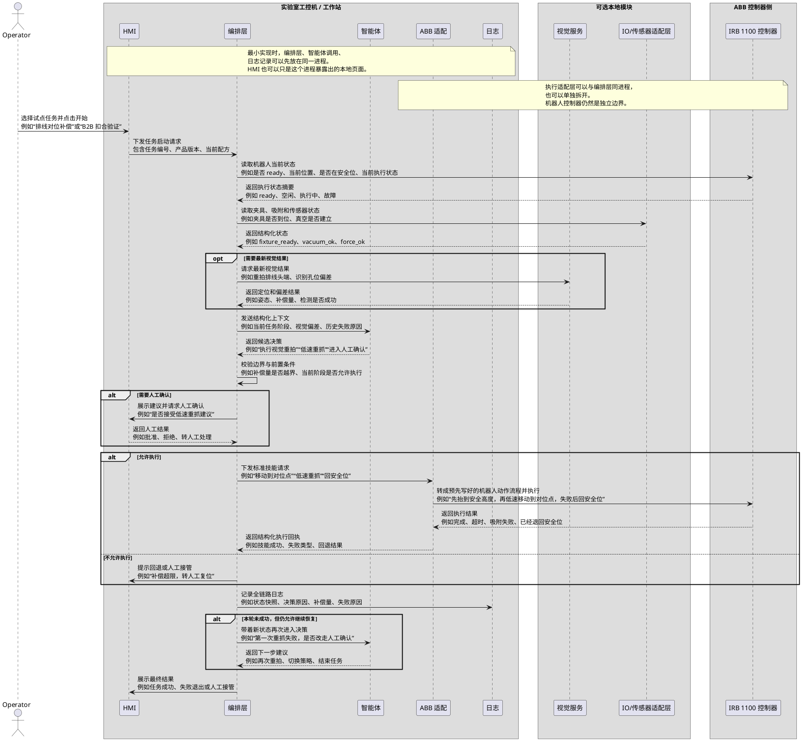

# 第 5 章：AI-first 的首个试点应该怎么定义

摘要：首个 `POC` 不应写成泛化的“装配智能体项目”，而应直接绑定具体工艺问题。对 `ABB` 3C 柔性制造现场，更适合作为首轮试点的方向主要有两类：视觉伺服微调，以及视觉与力反馈融合的 `B2B` 扣合。关键是把目标、输入、输出、边界和成功标准写清楚。

## 名词解释

| 名词 | 说明 |
| --- | --- |
| `POC` | Proof of Concept，概念验证。这里指在受限边界内验证某项新能力是否成立，而不是交付完整系统。 |
| `MVP` | Minimum Viable Product，最小可行产品。通常更接近可上线、可交付或可持续使用的产品形态。本文讨论的首个试点不应被理解成 `MVP`。 |
| `SOP` | Standard Operating Procedure，标准作业流程，用于规定现场人员或系统在某个步骤中应按什么顺序执行。 |
| `视觉伺服` | 在已有 `SOP`、治具和标准轨迹不变的前提下，根据视觉识别到的实际偏差，对关键点位做在线微调。 |
| `6D 姿态` | 对象在空间中的位置与姿态，通常包括 `X`、`Y`、`Z` 和 `Rx`、`Ry`、`Rz`。 |
| `补偿量` | 实际位置相对于理论位置的偏移量，例如 `ΔX`、`ΔY`、`ΔZ`、`ΔRx`、`ΔRy`、`ΔRz`。 |
| `B2B 扣合` | Board-to-Board 连接器扣合或压接过程，常见于 Display flex、连接器母座、盖板入 HSG 等精密装配动作。 |
| `力反馈` | 通过力/力矩传感器感知接触状态，用于判断卡边、倾斜、滑入、扣合到位等装配状态。 |
| `工站` | 产线中的一个具体工作单元，通常包含机器人、夹具、相机、工艺设备和相关控制逻辑。 |

到了定义首个试点这一步，最常见的问题不是技术不够新，而是题目写得过大、过虚，最后变成边界模糊的展示项目。

更适合作为首轮试点的，通常是下面两类 `POC`：

1. `视觉伺服微调 POC`
   适用于排线穿孔、异形排线定位、排线整理、贴附前对位这类“标准路径已经有，但实际位置会偏”的场景。
2. `视觉 + 力反馈融合 B2B 扣合 POC`
   适用于 Display flex B2B、盖板入 `HSG`、连接器压合这类“最后几毫米被遮挡、纯视觉盲扣良率不够”的场景。

这两个方向有几个共同特点：

* 都不要求推翻现有 `SOP`
* 都不要求第一天就重写整条机器人程序
* 都可以保留 `ABB`、`PLC`、治具和工艺验证成果
* 都能把 AI 的作用限定在“补偿、引导、判断、恢复”这类更容易落地的环节

因此，这一章直接围绕这两类 `POC` 展开，重点说明它们分别适合什么工艺、边界应如何收缩，以及输入、输出和成功标准应该怎样定义。

## 1. 首个试点不应抽象定义，而应绑定具体工艺问题

### 1.1 如果问题不绑定工艺，试点就会迅速失焦

在真实工厂里，首个试点通常不会以“探索具身智能在制造中的潜力”这种方式立项。现场真正会问的是：

* 排线穿孔为什么还要人工二次修正
* 为什么同一条示教路径换一批料就容易偏
* 为什么 B2B 扣合良率只能稳定在 80% 左右
* 为什么最后几毫米一被遮挡就只能盲压

如果这些问题不先写清，团队就很容易一上来做成一个“什么都想验证一点”的系统，最后既不能回答补偿是否成立，也不能回答扣合是否真的改善。

### 1.2 用这两个方向定义首个试点，更符合 ABB 3C 现场问题

这两个方向都适合作为首轮 `POC`，因为它们都建立在同一个现实前提上：

* 现有 `SOP`、治具、标准轨迹和站级控制逻辑仍然成立

试点重点不在于让 AI 重新发明整套动作，而在于补足现有流程中最难稳定的那一段：

* 视觉伺服方向补的是“理论位置和实际位置之间的偏差”
* 视觉 + 力反馈方向补的是“接触、插入、扣合最后几毫米里的不确定性”

### 1.3 这两个方向都是 `POC`，不是 `MVP`

这两个试点都不应该被写成 `MVP`。如果写成 `MVP`，团队会很自然地被拉去补：

* 更完整的界面
* 更宽的工艺覆盖
* 更长的稳定运行
* 更通用的能力抽象

但首轮试点真正要回答的是更小、更硬的问题：

* 视觉伺服能不能在不改写整条路径的前提下，稳定给出关键点补偿量
* 视觉 + 力反馈能不能在遮挡出现后，用力学信息接管最后几毫米的扣合引导

因此，这两个方向都应按受限 `POC` 来定义，而不是按产品化 `MVP` 来定义。

## 2. 两类试点分别适合什么场景

### 2.1 视觉伺服微调 POC

这类试点最适合下面这些工艺：

* 排线穿孔
* 异形排线定位
* 排线整理
* 贴附前对位
* 已有标准路径但存在小偏差的高精度 pick-and-place

这类工艺的共同特征是：

* 标准路径已经存在
* `SOP` 已经被现场验证
* 真正的不稳定，来自工件位置、姿态和装夹误差
* 失败通常不是因为“整条轨迹都错了”，而是因为关键点位需要微调

这类 `POC` 的核心不是重新规划整条新路径，而是：

* 保留原来的标准路径
* 在执行前或执行中识别实际偏差
* 只修正 `接近位`、对位点、插入点这类关键点

对现场工程师来说，这类方案更容易接受，因为保留下来的仍然是：

* 原来的路径
* 加上有限的补偿量

### 2.2 视觉 + 力反馈融合 B2B 扣合 POC

这类试点最适合下面这些工艺：

* Display flex `B2B` 扣合
* 盖板入 `HSG`
* 连接器压合
* 被遮挡后仍需继续插入或扣合的精密接触动作

这类工艺和视觉伺服不同。它们的问题不在“起始位置找不到”，而在于：

* 接近阶段视觉通常还能工作
* 真正进入接触和扣合阶段后，目标会被遮挡
* 纯视觉方案只能盲压
* 力传感器如果只做超限保护，就无法真正引导扣合

这类 `POC` 的核心不是把视觉继续做得更准，而是建立分阶段机制：

* 视觉负责找到接近姿态
* 力反馈负责接手接触后的纠偏和扣合判断

这类问题更难，但它对应的正是连接器装配良率提升中最困难的一段。

### 2.3 推荐顺序

如果团队资源有限，建议顺序如下：

1. 先做视觉伺服微调 `POC`
2. 后做视觉 + 力反馈融合 `POC`

主要原因是：

* 视觉伺服更容易复用现有 `SOP` 和标准路径
* 视觉伺服更容易先形成可解释的补偿量输出
* `B2B` 扣合需要额外处理接触语义、力曲线解释和微动作探索

先做视觉伺服，更容易在首轮试点里把边界、数据和评价方式跑顺；`B2B` 扣合更适合在第二阶段继续推进。

## 3. 试点应该怎样切小

### 3.1 视觉伺服 POC 应切成单工站、单工艺、单补偿目标

建议按下面的方式收缩范围：

* 单工站
* 单一工艺，例如排线穿孔或异形排线定位
* 单一目标，例如“对位点和插入点在线补偿”

首轮不要同时覆盖：

* 多类排线
* 多种治具
* 多道装配动作
* 多工站联动

视觉伺服方向首先要看的，也不是“系统是否更智能”，而是：

* 补偿后关键点命中率是否提升
* 人工二次修正次数是否下降
* 节拍增加是否仍在可接受范围内

### 3.2 B2B 扣合 POC 应切成单连接器类型、单扣合动作、单接触策略

建议按下面的方式收缩范围：

* 单连接器类型
* 单一扣合动作
* 单一接触阶段策略，例如“视觉粗定位 + 力引导最终扣合”

首轮不要同时覆盖：

* 多种连接器尺寸
* 多类盖板 / `HSG`
* 多种装配方向
* 多套力传感器策略

`B2B` 方向首先要看的，也不是“机器人能不能动起来”，而是：

* 扣合良率能否显著提升
* 盲压失败率能否下降
* 是否能识别卡边、倾斜、未完全扣入等典型状态

### 3.3 两个方向都不该做成端到端重构

无论是哪一个方向，首轮 `POC` 都不应写成：

* 重写整条机器人程序
* 替代 `PLC` 互锁
* 取消现有 `SOP`
* 让 AI 自由生成全新轨迹

这样做不会让试点更先进，只会把风险一下子放大到无法验证。

更稳妥的原则是：

* 保留原有工艺骨架
* 只验证新增能力是否成立

## 4. 试点边界应该怎么写

### 4.1 视觉伺服 POC 的边界

视觉伺服方向建议按下面的方式写边界：

| 维度 | 建议边界 |
| --- | --- |
| 业务边界 | 仅针对排线穿孔、异形排线定位或排线整理中的关键点位微调 |
| 控制边界 | 不重构整条轨迹，只修改关键点补偿量 |
| 感知边界 | 只输出 `6D` 姿态和补偿量，不直接生成整条新动作 |
| 工艺边界 | 保留现有 `SOP`、治具和标准路径 |
| 安全边界 | 补偿量必须有限幅，超出阈值直接退回人工或报警 |

### 4.2 B2B 扣合 POC 的边界

`B2B` 方向建议按下面的方式写边界：

| 维度 | 建议边界 |
| --- | --- |
| 业务边界 | 仅针对单一连接器类型的扣合或压合动作 |
| 控制边界 | 只验证“视觉粗定位 + 力引导扣合”的分阶段策略 |
| 感知边界 | 视觉负责接近阶段，力负责接触后的状态判断和微动作引导 |
| 工艺边界 | 不改变现有装配顺序，只优化最后接触与扣合段 |
| 安全边界 | 力阈值、位移阈值、重试次数和退出条件必须预先写死 |

### 4.3 两个方向共同的不做事项

首轮 `POC` 应明确不做：

* 不替代 `PLC` 站级互锁
* 不直接改写 `ABB` 主程序主链路
* 不进入安全回路
* 不追求多工站泛化
* 不追求通用平台化

### 4.4 实验室试点的最小闭环应该长什么样

如果当前试点还不在真实产线，而是在实验室里围绕一台 `IRB 1100` 做验证，那么读者需要先建立一个更具体的判断：

* 这时不一定需要先上 `PLC`
* 但也不应该让智能体直接连机器人控制器

更适合的最简闭环是：

* `HMI` 或调试页面负责启动任务和人工确认
* 编排层负责汇总状态、调用智能体、路由技能和记录日志
* 智能体服务负责根据当前上下文返回结构化决策
* `ABB` 执行适配层负责把上层技能请求转成机器人可执行的预先写好动作流程
* `IRB 1100` 控制器负责执行这些已经验证过的动作流程
* 可选的视觉服务、力传感器或吸附/夹具 `IO` 提供补充状态

这个结构的关键不在于设备是否齐全，而在于职责是否清楚：

* 智能体只负责生成候选决策
* 站级编排负责边界检查和流程推进
* 机器人只执行受限、可验证的预定义动作流程

如果用一张时序图来表示，一个实验室 `POC` 的最小工作流程可以写成下面这样。这里的 `participant` 表示职责角色，不等于每一项都必须单独部署成一个服务。为了让试点概念更具体，下面的连线说明同时带了小型装配场景里的典型例子，例如排线对位补偿、视觉重拍、低速重抓或连接器扣合恢复。

如果按最小实现去落地，这张图通常可以这样理解：

* 同一进程：编排层、智能体调用逻辑、日志记录
* 同机可合并：`HMI`、`ABB` 执行适配层
* 可选独立模块：视觉服务、`IO / 传感器` 采集
* 必然独立边界：`IRB 1100` 控制器

这张图要表达的不是“系统已经做得很完整”，而是首轮试点至少应具备一条能跑通的能力链路：

* 任务启动
* 状态采集
* 智能体决策
* 约束检查
* 技能执行
* 结果记录

只要这条链路成立，哪怕当前还没有正式 `PLC`、没有复杂工站联动、没有完整产线接口，试点也已经具备了工程验证价值。

## 5. 试点输入、输出和成功标准如何定义

下面直接给出两类 `POC` 的输入、输出和成功标准模板。

### 5.1 视觉伺服微调 POC：输入、输出和成功标准

这类 `POC` 的目标是在已有 `SOP`、治具和标准轨迹的前提下，为关键点提供在线补偿，而不是重写整条动作。

**输入定义模板**

| 输入项 | 具体内容 | 最低要求 | 备注 |
| --- | --- | --- | --- |
| 工艺对象 | 排线、孔位、连接器、`DP` 板、`HSG`、治具 | 明确本次只选 `1` 类工艺对象 | 不要同时覆盖多类零件 |
| 标准路径 | 原有 `SOP`、示教路径、离线编程轨迹 | 至少包含 `接近位`、对位点、插入点、退出点 | 这是补偿基准，不是要被推翻的对象 |
| 标准模型 | 理论点位、标准姿态、工件参考坐标 | 理论模型可复现 | 用来计算相对偏差 |
| 视觉输入 | 当前工件、排线、孔位、连接器的图像或点云 | 能稳定采集到试点工位数据 | 重点是关键对象，不是全景大模型 |
| 标定结果 | 相机、治具、工件、机械臂之间的坐标关系 | 至少完成基础标定 | 没有标定就没有可信补偿 |
| 偏差标签 | `ΔX`、`ΔY`、`ΔZ`、`ΔRx`、`ΔRy`、`ΔRz` | 能对关键样本做偏差标注 | 不要求一开始就海量数据 |
| 补偿边界 | 每个关键点允许补偿的最大范围 | 必须预先设定上限 | 超限时直接退回人工 |

**输出定义模板**

| 输出项 | 具体产物 | 应达到的状态 |
| --- | --- | --- |
| `6D` 姿态结果 | 当前对象相对于理论模型的完整姿态 | 可直接用于计算补偿量 |
| 关键点补偿量 | `接近位`、对位点、插入点等关键点的 `ΔX/ΔY/ΔZ/ΔR` | 只修正关键点，不改整条轨迹 |
| 补偿后路径片段 | 原路径 + 局部补偿结果 | 现场工程师能看懂补偿来自哪里 |
| 结果记录 | 本次补偿是否成功、补偿量是否越界、是否退回人工 | 可用于回放和对比 |

**成功标准模板**

| 维度 | 建议指标 | 示例问法 |
| --- | --- | --- |
| 姿态识别 | 关键对象 `6D` 姿态输出是否稳定 | 排线头端、孔位、连接器姿态能否稳定输出 |
| 补偿有效性 | 加入补偿后，关键点命中率是否提升 | 对位点和插入点偏差是否明显下降 |
| 工艺友好性 | 是否保留原有 `SOP` 和标准路径 | 是否仍能用“原路径 + 补偿量”解释动作 |
| 风险可控性 | 是否始终在补偿边界内运行 | 补偿超限时是否能立即退回人工 |
| 生产价值 | 人工二次修正次数、装配失败率是否下降 | 排线穿孔偏位、压伤、二次对位是否减少 |

**推荐立项写法**

| 模板项 | 建议填写内容 |
| --- | --- |
| 试点名称 | 排线穿孔视觉伺服微调 `POC` |
| 核心假设 | 保留标准路径不变，只对关键点做视觉补偿，可以降低偏位和人工二次修正 |
| 场景范围 | 单工站、单一排线工艺、单一治具配置 |
| 输入 | 标准路径、视觉图像、标定关系、关键点偏差标签、补偿边界 |
| 输出 | `6D` 姿态、关键点补偿量、补偿后关键路径、回放记录 |
| 成功标准 | 偏差下降、失败率下降、补偿可解释、边界可控 |

### 5.2 视觉 + 力反馈融合 B2B 扣合 POC：输入、输出和成功标准

这类 `POC` 的目标是建立“视觉负责找入口，力负责完成扣合”的多模态闭环，而不是继续依赖盲压。

**输入定义模板**

| 输入项 | 具体内容 | 最低要求 | 备注 |
| --- | --- | --- | --- |
| 工艺对象 | Display flex `B2B` connector、盖板、`HSG`、母座 | 明确本次只做 `1` 类连接器装配 | 不要混多种连接器规格 |
| 视觉粗定位输入 | 连接器位置、姿态、接近区域、母座位置 | 能输出初始 `X/Y` 偏移、角度和高度差 | 视觉不负责最后几毫米 |
| 力/力矩输入 | `Fx/Fy/Fz`、`Tx/Ty/Tz` 曲线 | 采样频率和同步机制明确 | 必须能与动作过程对齐 |
| 接触语义样本 | 顶住、滑入、卡边、倾斜、扣合到位等典型状态 | 至少有初始语义定义 | 不要求第一天就完美分类 |
| 微动作集合 | 左右微摆、轻微旋转、小幅下压、后退再压等动作模板 | 每个动作边界和幅度明确 | 例如 ±0.1 mm、±1° |
| 安全边界 | 力阈值、位移阈值、重试次数、退出条件 | 必须第一天就写死 | 超限立刻退出 |

**输出定义模板**

| 输出项 | 具体产物 | 应达到的状态 |
| --- | --- | --- |
| 粗定位结果 | 接近阶段的初始偏差结果 | 能把连接器带到可接触但未压合的位置 |
| 切换判据 | 何时从视觉主导切到力主导 | 例如接近距离阈值、接触触发阈值 |
| 接触状态判断 | 当前更像顶住、滑入、卡边、倾斜还是已扣合 | 至少能区分核心几类状态 |
| 微动作决策 | 下一步应微移、微转、继续压合还是退出 | 动作必须来自预定义模板 |
| 扣合结果 | 扣合成功、失败退出、人工接管 | 可复盘、可统计 |

**成功标准模板**

| 维度 | 建议指标 | 示例问法 |
| --- | --- | --- |
| 粗定位能力 | 视觉是否能稳定把连接器带到可接触区域 | 距离接触面 `0.5-1 mm` 内是否稳定 |
| 力反馈解释能力 | 力曲线能否被翻译成装配状态 | 能否区分顶住、卡边、滑入、扣合到位 |
| 微动作有效性 | 微摆、微转、再压是否提升最终扣合成功率 | 与纯视觉盲压相比，成功率是否明显提升 |
| 风险可控性 | 是否始终遵守力阈值和退出条件 | 是否出现过压、卡死、越权持续尝试 |
| 生产价值 | 良率是否从当前水平提升到更可接受区间 | 是否有机会从约 `80%` 提升到 `95%+` 的方向上 |

**推荐立项写法**

| 模板项 | 建议填写内容 |
| --- | --- |
| 试点名称 | Display flex B2B 视觉 + 力反馈融合扣合 `POC` |
| 核心假设 | 视觉负责找入口，力负责引导扣合，可以降低盲压失败并提升最终扣合良率 |
| 场景范围 | 单工站、单连接器类型、单扣合动作 |
| 输入 | 粗定位结果、力/力矩曲线、接触语义样本、微动作集合、安全阈值 |
| 输出 | 切换判据、接触状态判断、微动作决策、扣合结果记录 |
| 成功标准 | 状态判断有效、微动作有效、良率提升、风险可控 |

### 5.3 两个方向的对比选择表

如果立项阶段只能先选一个方向，可以直接用下面这张表：

| 方向 | 更适合的工艺 | 技术难度 | 现场友好度 | 首轮推荐度 | 关键价值 |
| --- | --- | --- | --- | --- | --- |
| 视觉伺服微调 | 排线穿孔、异形排线定位、排线整理、贴附前对位 | 中等 | 高 | 很高 | 保留现有路径，只补偿关键点 |
| 视觉 + 力反馈 B2B 扣合 | Display flex B2B、盖板入 `HSG`、连接器压合 | 高 | 中等 | 高，适合在第二阶段推进 | 解决视觉失效后的最后几毫米扣合问题 |

## 6. 8 到 12 周的首轮试点节奏

### 6.1 视觉伺服 POC 的 8 到 12 周节奏

`第 1-2 周`

* 选定单工站、单工艺对象、单一补偿目标
* 整理现有 `SOP`、标准路径、标定关系和补偿边界

`第 3-5 周`

* 收集关键对象视觉样本
* 完成 `6D` 姿态和偏差输出
* 建立关键点补偿映射

`第 6-8 周`

* 在受限真机或回放环境中验证关键点补偿
* 记录补偿量、成败结果和人工接管情况

`第 9-12 周`

* 与原路径方案做对比
* 给出偏差下降、失败率变化和边界结论

### 6.2 `B2B` 扣合 POC 的 8 到 12 周节奏

`第 1-2 周`

* 选定单连接器类型、单扣合动作、单一良率目标
* 写清视觉阶段、接触阶段和退出边界

`第 3-5 周`

* 采集视觉粗定位数据和力/力矩曲线
* 初步标注接触语义状态
* 固化可用微动作模板

`第 6-8 周`

* 形成“视觉粗定位 + 力引导扣合”的受限闭环
* 在边界内验证顶住、卡边、滑入、扣合到位等典型状态

`第 9-12 周`

* 与纯视觉盲压方案做对比
* 给出良率、失败类型和安全边界结论

## 结论

首个试点更适合按下面的顺序展开：

* 先做视觉伺服微调 `POC`
* 再做视觉 + 力反馈融合 `B2B` 扣合 `POC`

前者适合先验证“标准路径 + 在线补偿”能否成立，后者适合进一步验证“视觉找入口、力反馈完成扣合”的多模态闭环能否成立。两者都不是 `MVP`，而是围绕具体工艺瓶颈定义的受限 `POC`。这样写，首轮试点才会是一个可验证、可复盘、可继续投入的工程课题，而不是一个边界模糊的展示系统。

## 继续阅读

* 返回索引：[AI-first 文章索引](./abb-isaac-agent-flexible-manufacturing-ai-first-index.md)
* 上一章：[第 4 章：ABB、PLC、工艺、安全分别构成什么约束层](./abb-isaac-agent-flexible-manufacturing-ai-first-04-industrial-constraint-layer.md)
* 下一章：[第 6 章：AI-first 的最小研究系统架构](./abb-isaac-agent-flexible-manufacturing-ai-first-06-minimum-system.md)
