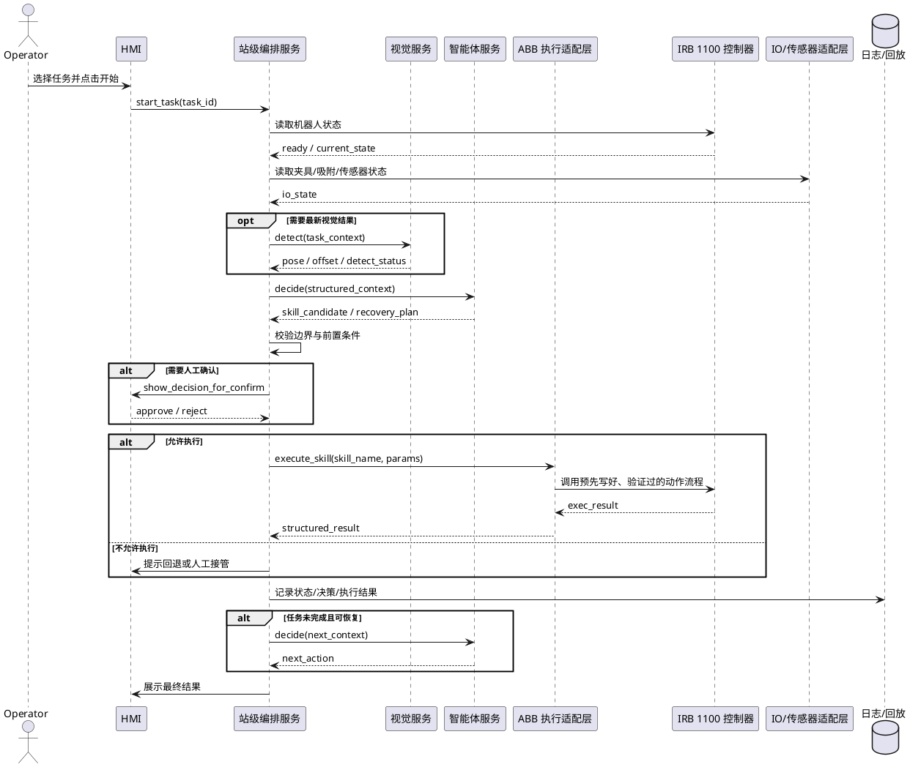

# 第 6 章：AI-first 的最小研究系统架构

摘要：这一章把系统设计从传统控制链转成能力闭环，重点是 AI 如何安全地接到工业执行现实。

## 名词解释

| 名词 | 说明 |
| --- | --- |
| `HMI` | Human Machine Interface，人机界面，用于现场查看状态和执行操作。 |
| `上位机` | 位于设备控制之上的工业计算机或软件系统，负责监控、调度与交互。 |
| `能力闭环` | 从输入、决策、执行到评估与回放完整连通的验证结构。 |
| `回放` | 基于历史日志重现任务过程，用于分析、评估和定位问题。 |
| `技能接口` | AI 系统调用执行能力时使用的标准输入输出接口。 |
| `约束适配层` | 把 AI 决策转换为符合工业边界的可执行请求与限制条件的中间层。 |
| `OPC UA` | 工业现场常见的标准化通信协议，适合从 `PLC` 或站级网关读取结构化状态与设备信号。 |
| `REST / gRPC` | 常见服务接口方式，适合智能体服务、视觉服务、站级编排服务之间交换结构化请求和结果。 |
| `WebSocket` | 适合把工站实时状态、建议结果和人工确认事件推送到 `HMI` 或监控界面。 |

如果前一章解决的是：

* 首个试点该验证哪一种能力
* 试点边界应该怎样收缩
* 什么样的目标才算有效的第一刀

那么这一章要解决的问题就是：

**一旦试点被定义成一个“能力验证项目”，系统架构应该怎么搭。**

这个问题之所以重要，是因为很多团队虽然已经接受了 `AI-first` 的判断，但一到真正设计系统时，还是会迅速滑回两种旧路径：

* 要么继续按传统自动化项目思路，把系统理解成一条更复杂的控制链
* 要么继续按通用 AI 平台思路，试图先搭一个大而全的 Agent 基座

这两条路径都不适合作为首个试点的起点。

前者的问题在于：

* 它会让 AI 再次退回辅助位置

后者的问题在于：

* 它会让系统失去工业插入点和可验证性

因此，AI-first 的最小研究系统，不应被理解成：

* 一个缩小版整站控制系统
* 一个通用具身智能平台雏形

而应被理解成：

* 一个围绕某种新能力建立的受限能力闭环

## 本章目标

这一章有四个目标：

1. 说明 AI-first 的最小系统应围绕哪些核心层来组织。
2. 说明 AI 能力层应怎样接到工业约束层与执行层。
3. 说明日志、回放、案例和评估为什么不是附属模块，而是主体结构。
4. 说明首个试点里哪些接口必须第一天就定清。

## 1. AI-first 最小系统首先不是控制系统，而是能力系统

### 1.1 系统设计的起点不应是“机器人怎么动”，而应是“能力怎么成立”

传统自动化项目在设计架构时，通常会从执行链出发：

* 设备
* 控制器
* PLC
* 上位机
* HMI

这是合理的，因为那类项目的目标是：

* 把稳定循环跑起来

但 AI-first 试点的核心目标不是“再做一套站级执行系统”，而是：

* 验证系统是否获得了新的变化吸收能力

因此，它的架构起点也必须跟着变化。

更合适的起点应当是：

* 这个系统要验证哪一种能力
* 这种能力需要什么输入
* 这种能力通过什么决策结构体现
* 这种能力如何被约束、执行、评估和回放

### 1.2 最小系统不追求完整，而追求能力闭环

“最小”这个词在这里非常关键。

它不是指：

* 功能少一点

而是指：

* 只保留对当前能力验证真正必要的结构

例如，如果首个试点验证的是：

* 单站异常恢复支持

那么系统真正需要重点建设的，通常不是：

* 复杂的通用任务规划器
* 泛化到多工站的统一调度平台

而是：

* 状态与异常输入
* 案例和知识检索
* 恢复建议逻辑
* 人工确认与回退接口
* 结果记录与对比评估

所以 AI-first 最小系统的设计原则应该是：

* 先围绕一个能力闭环成立，再谈平台化

## 2. 一个更合理的 AI-first 最小系统分层

### 2.1 第一层：上下文与状态输入层

这一层的职责是把系统真正需要理解的现场上下文收进来。

它不只包含视觉输入，还应包括：

* 工站当前阶段
* 产品或机种上下文
* 配方与任务版本
* PLC 或站级状态摘要
* ABB 执行状态摘要
* 异常、报警和历史事件
* 人工操作痕迹

对 AI 团队来说，这一层的重要性极高。因为很多系统之所以看起来“不智能”，不是模型不够强，而是它看到的上下文过于贫瘠。

如果输入只有图像，系统大概率只能做局部感知。
如果输入包括任务、状态、历史和异常，它才有机会进入真正的任务级决策。

例如，面对一次抓取失败，如果系统只看到一张当前图像，它最多判断“没抓住”。但如果它同时知道当前产品版本、上一拍视觉结果、`PLC` 的工位状态、最近两次失败原因和人工是否刚刚接管过，它就能区分这更像是来料姿态异常、夹具未 ready，还是某组参数需要切换。

### 2.2 第二层：任务与能力决策层

这一层才是 AI-first 系统的核心。

它负责的不是底层连续控制，而是：

* 当前问题属于哪一种任务上下文
* 当前应调用哪一种策略或技能
* 当前异常应归入哪一类恢复路径
* 当前换型应如何生成任务模板和参数建议
* 当前多模块状态下应如何选择下一步动作资格候选

如果系统中引入 Agent、多模态推理或任务级模型，这一层通常就是最合理的插入位置。

因为这一层最接近：

* 泛化
* 换型
* 恢复
* 协同

这四类 AI 主能力。

比如在换型场景里，这一层真正要决定的不是“电机怎么转”，而是“当前是沿用旧模板、切换到相邻模板，还是生成一份新的人工确认清单”。这才是任务与能力决策层的职责。

### 2.3 第三层：约束适配与资格裁决层

这是 AI-first 系统与传统工业系统真正接上的地方。

这一层的作用不是增强智能，而是约束智能。它至少要负责：

* 把 AI 输出映射成受限操作候选
* 检查前置条件是否满足
* 判断哪些建议必须人工确认
* 判断哪些动作不允许通过
* 判断失败后应退回哪里

这一层本质上是：

* AI 能力层和工业约束层之间的翻译与过滤层

如果没有这一层，AI 输出就会直接撞上执行世界，系统很容易失控。

例如，模型输出一句“建议重新抓取并降低速度”并不能直接执行。约束适配层必须先把它翻译成受限候选：当前是否满足重抓前置条件，是否允许切换到低速模板，是否必须先退回安全位，是否需要人工确认。没有这一步，建议既不可执行，也不可审计。

### 2.4 第四层：技能执行与工业接口层

这一层承接的不是“任意动作”，而应是一组被验证过、边界清晰的技能。

例如：

* 读取某类状态摘要
* 触发某个已验证技能流程
* 请求视觉重拍
* 请求人工确认
* 触发某种回安全位动作
* 调用某个换型模板检查流程

这里最关键的原则是：

* AI 调用技能，不直接操纵执行器

一个更现实的做法是，AI 发出“请求重拍”“调用已验证的重抓技能”“进入换型检查流程”这类标准化请求，而不是直接给机器人下连续轨迹命令。这样技能边界清楚，现场也更容易维护。

这层真正连接的是：

* ABB 执行接口
* PLC 状态接口
* 视觉与工艺设备接口
* 人工接管接口

### 2.5 第五层：日志、回放与评估层

这一层常被团队放到后面补，但在 AI-first 系统里，它必须是首版主体结构。

因为首个试点真正要回答的不是：

* 系统能不能跑一次

而是：

* 某种能力是否成立
* 成立在什么边界内
* 失败模式有哪些
* 下一个版本该优化哪一层

例如，如果一次异常恢复试点运行了两周，团队真正关心的不该只是“系统跑过几次”，而应是：哪几类异常建议最有效，哪几类建议经常被人工否决，失败主要来自状态理解、技能边界，还是工艺条件遗漏。没有这一层，系统就无法持续进化。

这些问题离不开：

* 全链路日志
* 状态快照
* 决策记录
* 技能调用记录
* 人工接管记录
* 成败标签
* 可重复回放环境

没有这一层，系统即使能跑，也无法演进。

## 3. 为什么“约束适配层”是 AI-first 架构里的关键

### 3.1 AI 的价值在于产生候选，不在于天然拥有执行权

对很多 AI 团队来说，最难接受的一点是：

* 为什么最关键的一层不是模型层，而是约束适配层

原因很简单。

在柔性制造里，AI 的核心价值通常是：

* 提供更好的候选策略
* 提供更好的任务理解
* 提供更好的恢复建议
* 提供更好的模板重组能力

但“候选更好”并不等于“天然拥有执行权”。

只有当这些候选被放进约束层之后，系统才可能形成：

* 可执行性
* 可责任归属
* 可回退性

### 3.2 约束适配层决定系统到底是在做研究，还是在做演示

如果一个系统缺少这一层，实际运行时通常会出现两种情况：

* 要么 AI 输出被人为手动解释，系统只能做演示
* 要么 AI 输出直接推动执行，系统边界不清，风险过高

只有当 AI 输出先变成：

* 结构化候选
* 带条件的技能请求
* 带置信和回退策略的建议

系统才真正接近一个可以被验证的研究系统。

### 3.3 这一层也是把 ABB、PLC、工艺、安全转成接口定义的地方

前一章已经讲过，四类工业约束不应被视为 AI 的对手，而应被视为 AI 必须穿过的现实。

在架构上，这种“穿过”的具体位置，通常就是约束适配层。

它需要把不同约束转成可计算的接口，例如：

* 哪类站级状态满足动作资格
* 哪类工艺条件决定任务完成是否算成功
* 哪类安全条件意味着只能建议、不能执行
* 哪类 ABB 执行条件意味着某技能只能调用预定义模板

## 4. 以小型精密电子装配单站为例，最小系统应怎样搭

### 4.1 如果验证目标是换型辅助，系统重点应放在模板与上下文组织

假设一个团队选择一个 `ABB 小负载高精度装配工站`，例如 `YuMi`、`IRB 920/910SC`、`IRB 1100` 一类更靠近小件装配的单工站，首个试点验证的是：

* AI 是否能提升相邻产品版本切换时的换型效率

那么系统重点应当是：

* 产品版本与任务模板映射
* 参数差异识别
* 视觉配置差异整理
* 人工确认步骤生成
* 历史换型案例回放

如果把场景压得更具体，这一层通常就是：

* 新手机小件或 3C 变体导入时，哪些抓取模板、补偿参数、视觉阈值和人工确认步骤需要切换

而不是把主要精力放在：

* 新做一套机器人执行系统
* 直接重新定义底层动作控制

### 4.2 如果验证目标是异常恢复，系统重点应放在案例与恢复路径

如果同样的工位改成验证：

* 高频异常下的恢复支持能力

那么系统重点应立即切换到：

* 异常分类结构
* 状态与报警汇总
* 恢复步骤生成
* 人工确认接口
* 恢复结果记录
* 案例检索与相似问题比对

这说明一件事：

* AI-first 最小系统的核心不会完全固定，它必须围绕当前验证能力重排重点

### 4.3 不变的底盘，是四类固定能力

虽然不同试点的重点不同，但最小系统里仍有几类底盘最好固定下来：

* 状态输入规范
* 决策记录规范
* 技能请求规范
* 回放与评估规范

只要这四类规范尽早固定，后面从一个试点切到下一个试点时，系统复用性会高很多。

### 4.4 一个更贴近 ABB 3C 单站的实际连接方式

如果把场景进一步压缩到 `ABB` 的 3C 柔性制造单站，一个更现实的最小部署形态通常不是“智能体直接连接所有设备”，而是：

* 智能体服务负责理解上下文、生成候选决策
* 站级编排服务负责汇总状态、调用技能、记录日志
* `PLC / IO` 网关或实验室 `IO` 适配层负责提供站级资格和设备状态
* `ABB` 执行适配层负责把标准动作请求映射到预定义执行模板
* 视觉服务和工艺设备服务分别提供检测结果和设备结果
* `HMI` 负责人工确认、拒绝和回退

更实践的连接关系可以写成下面这张表：

| 模块 | 典型职责 | 推荐连接方式 | 常见接口/协议 | 备注 |
| --- | --- | --- | --- | --- |
| 智能体服务 | 读取上下文，给出换型建议、恢复建议或技能候选 | 与站级编排服务双向连接 | `REST / gRPC` | 不直接碰控制器和安全回路 |
| 站级编排服务 | 汇总状态、调用技能、落日志、处理人工确认 | 作为中间层连接上下游 | `REST / gRPC`、内部事件总线 | 是最小系统的实际中枢 |
| `PLC / IO` 网关或实验室 `IO` 适配层 | 提供夹具、真空、设备 ready、安全门等状态 | 站级编排主动读或订阅 | `OPC UA`、`Modbus TCP`、站级 `TCP` 接口、本地采集接口 | 有 `PLC` 时优先读结构化状态；实验室阶段也可以先由本地 `IO` 适配层代替 |
| `ABB` 执行适配层 | 把“移动到抓取位”“移动到对位点”“低速重抓”“回安全位”这类标准请求映射到预先写好、验证过的动作流程 | 由站级编排调用 | 本地适配服务、站级 `TCP Socket`、封装后的执行接口 | 例如先到安全接近位，再到对位位，失败后回安全位；关键原则是不让智能体直接生成底层动作 |
| 视觉服务 | 返回定位结果、偏差、检测状态、复检结果 | 由站级编排或智能体请求 | `REST / gRPC` | 返回结构化结果，不要只回图片 |
| `HMI` / 人工确认端 | 展示建议、接收人工确认、记录拒绝原因 | 订阅状态并提交人工决策 | `WebSocket`、`HTTP` | 人工接管点必须进入系统日志 |

如果用一句话概括这套连接方式，就是：

* 智能体不直接控制机器人，而是通过站级编排服务读取状态、输出结构化候选，再由执行适配层和 `PLC / IO` 资格裁决决定哪些动作可以真的发生

这比“智能体直接接机器人控制器”更慢一些，但更符合 3C 柔性制造首轮试点的现实边界。

### 4.5 实验室里只有一台 IRB 1100 时，PLC 不是必选项

如果当前环境不是产线，而只是实验室里一台 `IRB 1100` 机械臂，那么首轮 `POC` 并不一定需要先上 `PLC`。

更实际的判断标准是：

* 如果只是验证单站任务闭环，设备数量很少，外围只有相机、夹具、吸附或力传感器，`PLC` 可以先不引入
* 如果需要把多类设备互锁、节拍联动、安全资格、复杂 `IO` 编排都纳入统一站控，再考虑引入 `PLC`

实验室阶段更常见的最简形态是：

* 一台运行智能体服务、站级编排服务和日志服务的工控机或工作站
* 一套 `ABB` 执行适配层，负责把上层技能请求转成机器人可执行的受限命令
* 一台 `IRB 1100` 与其控制器
* 可选的视觉服务
* 可选的力传感器或吸附、夹具等 `IO`
* 一个简单的 `HMI` 或调试页面

这时真正承担“轻量站控”职责的，不是 `PLC`，而是站级编排服务。它负责：

* 汇总机器人状态、视觉结果和 `IO` 状态
* 调用智能体服务生成候选决策
* 检查前置条件和边界
* 调用 `ABB` 执行适配层执行技能
* 记录日志、支持回放和人工接管

但有一点不能混淆：

* 不上 `PLC`，不等于让智能体直接接管安全

实验室环境下，急停、安全门、控制器权限、回安全位等硬边界，仍然应留在机器人控制器和硬件安全链路里。站级编排服务只能代替轻量站控，不能代替安全回路。

### 4.6 最简硬件环境下，智能体应怎样连接

如果把试点进一步压缩到“一台 `IRB 1100` + 一台工控机 + 可选相机/传感器”，更建议采用下面这种连接方式：

| 模块 | 是否必需 | 主要职责 | 推荐连接方式 |
| --- | --- | --- | --- |
| 智能体服务 | 是 | 基于上下文生成结构化决策或技能候选 | 与站级编排服务通过 `REST / gRPC` 连接 |
| 站级编排服务 | 是 | 汇总状态、资格裁决、技能路由、日志记录 | 部署在工控机本地，作为系统中枢 |
| `ABB` 执行适配层 | 是 | 把“移动到抓取位”“移动到对位点”“低速重抓”“回安全位”等请求转成机器人可执行的预定义动作流程 | 与站级编排本地连接；下层对接控制器接口 |
| `IRB 1100` 控制器 | 是 | 执行这些已经验证过的动作流程，返回执行状态和结果 | 由执行适配层访问，不直接暴露给智能体 |
| 视觉服务 | 可选 | 返回定位、偏差、检测结果 | 可本地部署，通过 `REST / gRPC` 提供结构化结果 |
| 力传感器 / 吸附 / 夹具 `IO` | 可选 | 提供接触、吸附、夹具 ready 等状态 | 通过本地采集程序或 `IO` 适配层接入站级编排 |
| `HMI` / 调试页面 | 建议保留 | 启动任务、人工确认、查看建议和日志 | `HTTP` + `WebSocket` |

在这个拓扑里，推荐的连接原则是：

* 智能体只连站级编排服务，不直连机器人控制器
* 机器人控制器只接受执行适配层下发的标准技能请求
* 视觉、力反馈和 `IO` 都先转成结构化状态，再进入智能体上下文
* 所有执行结果都回到站级编排服务统一落日志

### 4.7 一个可执行的最小工作流程

以实验室中的单站 `POC` 为例，一次完整闭环可以按下面的流程运行：

1. 操作员在 `HMI` 上选择任务并点击开始。
2. 站级编排服务读取当前机器人状态、任务阶段、视觉结果以及可用的 `IO / 传感器` 状态。
3. 如果需要感知更新，站级编排服务先触发视觉服务获取最新定位或偏差结果。
4. 站级编排服务把结构化上下文发送给智能体服务，请它返回技能候选或恢复建议。
5. 站级编排服务检查边界条件，例如机器人是否 ready、当前任务阶段是否允许执行、补偿量是否越界、是否需要人工确认。
6. 条件满足时，站级编排服务调用 `ABB` 执行适配层，请求执行某个已验证技能。
7. 执行适配层把上层请求映射到预先写好的机器人动作流程，并向控制器发起执行。
8. 控制器返回执行结果，必要时附带当前位置、完成状态、失败类型或回安全位结果。
9. 站级编排服务汇总本次状态、决策、执行回执和人工操作，统一写入日志。
10. 如果任务完成则结束；如果失败则进入下一轮决策、恢复或人工接管。

这种流程已经足够支撑首轮实验室 `POC`，而且保留了后续接入 `PLC` 的空间。后面如果环境从实验室扩到真实工站，只需要把“实验室 `IO` 适配层”替换成正式 `PLC / IO` 网关，整体软件分层不需要推倒重来。

### 4.8 对应的 PlantUML 时序图

下面这张时序图对应的就是“实验室里一台 `IRB 1100`，`PLC` 可选”的最简闭环。



## 5. 首个版本哪些接口必须第一天就定义

### 5.1 状态接口必须先于模型接口

最容易被低估、但最应该最早定义的，不是模型 API，而是状态接口。

至少应明确：

* 当前任务阶段如何表示
* 当前产品上下文如何表示
* 当前异常类型如何表示
* 当前技能状态如何表示
* 当前人工接管点如何表示

如果这些不先定，后面几乎所有模块都会返工。

放到一个手机配件安装单站里，这件事通常比模型选型更早决定成败。比如同样是“没有完成抓取”，系统到底要记成 `pick_failed`、`vacuum_not_built`、`pose_invalid` 还是 `fixture_not_ready`，会直接决定后面恢复建议、案例检索和技能路由是否还能成立。如果前期只是模糊地记成“抓取异常”，等到要比较“先重拍还是先重抓”时，日志就已经不够用了。

### 5.2 决策输出接口必须天然可审计

AI-first 系统的决策输出，不应只是一个自然语言建议或一个隐式动作。

更合理的输出形式应至少包含：

* 决策类型
* 决策依据摘要
* 推荐技能或推荐路径
* 前置条件
* 是否需要人工确认
* 失败后的默认回退方式

这样后面才可能做：

* 责任分析
* 结果对比
* 失败复盘

在 3C 单站里，一个可审计的决策输出应该像“当前判断为吸附失败后的恢复决策，推荐 `vision_retake`，前置条件是相机 ready 且安全门关闭，不需要人工确认，失败后回退到 `manual_confirm`”，而不是一句“建议重新试一次”。只有把决策写成这种结构，现场工程师、运维人员和后续评估系统才有共同语言。

### 5.3 技能接口必须能回执、能超时、能失败

技能接口不能只定义：

* 调用了哪个能力

还必须定义：

* 前置条件是否满足
* 执行是否成功
* 失败属于哪一类
* 超时后如何处理

否则任务层再聪明，也很难形成稳定闭环。

例如，站级编排服务调用一次 `pick_retry_low_speed` 技能后，返回的不应只有“成功/失败”。更实用的回执应该至少包含：前置条件是否满足、是否真的发起执行、执行超时没有、失败是吸附失败还是路径中断、是否已经退回安全位。否则智能体只知道“又失败了”，却不知道下次该换策略、转人工，还是继续同一路径。

### 5.4 日志接口必须和状态、决策、技能接口一起设计

很多团队的问题不在于没有日志，而在于日志是后补的，因此很难和任务语义对齐。

更合理的做法是第一天就一起定义：

* 状态怎么记
* 决策怎么记
* 技能调用怎么记
* 人工接管怎么记
* 最终结果怎么打标签

这决定了后面系统是否真的能演进成数据资产。

如果放到手机配件安装试点里，日志最好能把一次完整闭环串起来：某个版本在什么阶段发生了什么异常，系统推荐了哪条恢复路径，现场是否接受了这条建议，技能执行结果怎样，最后是成功安装、人工接管，还是停机退出。只有这种成链条的日志，后面才可能真的做回放、对比分析和经验沉淀；如果日志只是零散的错误码和时间戳，系统就很难持续改进。

### 5.5 一个可直接落地的接口草案

如果把试点具体落到“手机配件安装流程智能体”，首版接口最好不要从自然语言开始，而是先把上下文、决策和技能请求做成结构化对象。

一个最小的上下文输入可以长这样：

```json
{
  "station_id": "3c_cell_01",
  "product_version": "camera_ring_v2",
  "task_stage": "pick_ready",
  "plc_state": {
    "fixture_ready": true,
    "vacuum_ok": false,
    "camera_ready": true,
    "safety_door_closed": true
  },
  "vision_result": {
    "part_found": true,
    "pose_ok": false,
    "offset_mm": 0.42
  },
  "last_errors": [
    "vacuum_fail",
    "vacuum_fail"
  ],
  "operator_mode": "auto"
}
```

一个最小的决策输出可以长这样：

```json
{
  "decision_type": "recovery",
  "recommended_skill": "vision_retake",
  "reason": "连续两次吸附失败，当前视觉可用，但姿态不稳定",
  "preconditions": [
    "camera_ready == true",
    "safety_door_closed == true"
  ],
  "requires_human_confirm": false,
  "fallback": "manual_confirm"
}
```

技能请求则不应是“帮我重新抓一下”这种模糊表达，而应是受限、可审计的标准报文：

```json
{
  "skill_name": "pick_retry_low_speed",
  "request_id": "req_20260331_0001",
  "params": {
    "recipe_id": "camera_ring_v2",
    "speed_profile": "low",
    "retry_index": 2
  },
  "timeout_ms": 5000,
  "on_timeout": "return_safe_pose",
  "requires_human_confirm": false
}
```

用伪代码表达这套逻辑，站级编排服务至少要做下面这几步：

```python
def handle_agent_decision(context, decision):
    if not context["plc_state"]["safety_door_closed"]:
        return reject("safety_not_ready")

    if decision["recommended_skill"] == "pick_retry_low_speed":
        if not context["plc_state"]["fixture_ready"]:
            return reject("fixture_not_ready")
        return call_skill(
            skill_name="pick_retry_low_speed",
            params={
                "recipe_id": context["product_version"],
                "retry_index": len(context["last_errors"]),
            },
        )

    if decision["requires_human_confirm"]:
        return push_hmi_confirm(decision)

    return reject("unsupported_decision")
```

这段伪代码的重点不在语言本身，而在结构：

* 智能体先输出结构化建议
* 站级编排服务检查资格条件
* 满足条件才调用技能
* 不满足条件就拒绝、回退或转人工确认

这才是一个能在 `ABB` 3C 单站里真正落地的最小接口闭环。

如果要把这条链路落实到团队分工和接口实现上，更建议直接按下面这张总表来拆：

| 链路阶段 | 谁提供 | 典型内容 | 推荐协议/形式 | 关键要求 |
| --- | --- | --- | --- | --- |
| 状态输入 | `PLC / IO` 网关、视觉服务、工艺设备、人工确认端 | 产品版本、任务阶段、设备 ready、异常码、视觉偏差、人工接管状态 | `OPC UA`、`REST / gRPC`、`WebSocket` 事件 | 必须结构化、可追时间戳、能区分真实信号和上层推断 |
| 决策输出 | 智能体服务 | 当前判断、推荐技能、前置条件、是否需人工确认、默认回退策略 | `JSON` / `gRPC` 响应 | 必须可审计，不能只返回自然语言 |
| 技能请求 | 站级编排服务 | `vision_retake`、`align_to_pose`、`pick_retry_low_speed`、`return_safe_pose` 等标准请求 | 内部 `REST / gRPC`、执行适配层接口 | 只能调用已验证技能，不能直接下底层连续控制命令 |
| 技能回执 | `ABB` 执行适配层、视觉服务、站级技能服务 | 是否执行、执行结果、失败类型、超时、是否已回退 | `JSON` / 结构化回执 | 必须返回失败原因，不能只有 success / fail |
| 日志记录 | 站级编排服务统一落库 | 状态快照、决策记录、技能调用、人工确认、最终标签 | 事件日志、数据库记录、回放文件 | 必须能把一次完整闭环串起来，支持回放和对比分析 |

如果再压成一句更工程化的话，就是：

* 状态输入决定系统看到了什么
* 决策输出决定系统建议做什么
* 技能请求决定系统真正调用什么
* 技能回执决定系统知道发生了什么
* 日志记录决定系统后续还能不能持续改进

这五类接口只要有一类没有定清，所谓“智能体系统”就很容易退化成一次性集成，而不是可验证、可演进的能力底盘。

## 6. 哪些东西不应该成为首版系统的核心

### 6.1 不要先做“大一统 Agent 平台”

首版系统最容易浪费时间的方向之一，就是试图先做一个：

* 能接多模型
* 能配多工具
* 能支持多场景
* 能扩展多工站

的平台。

这类工作在后期可能有价值，但作为第一版通常只会稀释重点。

### 6.2 不要让 UI 先于能力闭环

另一个常见偏差是过早追求：

* 漂亮的前端
* 复杂的监控面板
* 丰富的操作入口

这些都可以有，但不应先于：

* 状态闭环
* 决策闭环
* 回退闭环
* 评估闭环

### 6.3 不要把连续动作控制当成第一版主战场

除非试点本身就明确验证连续控制相关能力，否则第一版更不应把主要精力放在：

* 端到端动作输出
* 连续低层控制
* 复杂闭环轨迹学习

这些方向研究价值很高，但作为首轮试点的系统主战场，往往会过早放大不确定性。

## 结论

AI-first 的最小系统首先不是控制系统，而是一个围绕单一能力假设搭建的受限能力闭环。

它真正的重点不在于模型看起来多先进，而在于上下文与状态是否充分、决策是否能穿过约束适配层、技能调用是否有资格裁决、整个过程是否能被记录、回放和评估。这个闭环至少应包含上下文与状态输入、任务与能力决策、约束适配与资格裁决、技能执行与工业接口、日志回放与评估这五层。只要这条闭环成立，系统就有研究价值；如果没有这条闭环，再复杂的架构也更像演示，而不是能力系统。

## 继续阅读

* 返回索引：[AI-first 文章索引](./abb-isaac-agent-flexible-manufacturing-ai-first-index.md)
* 上一章：[第 5 章：AI-first 的首个试点应该怎么定义](./abb-isaac-agent-flexible-manufacturing-ai-first-05-first-pilot.md)
* 下一章：[第 7 章：从仿真、数据、世界模型到受限真机](./abb-isaac-agent-flexible-manufacturing-ai-first-07-sim-data-worldmodel-to-real.md)
