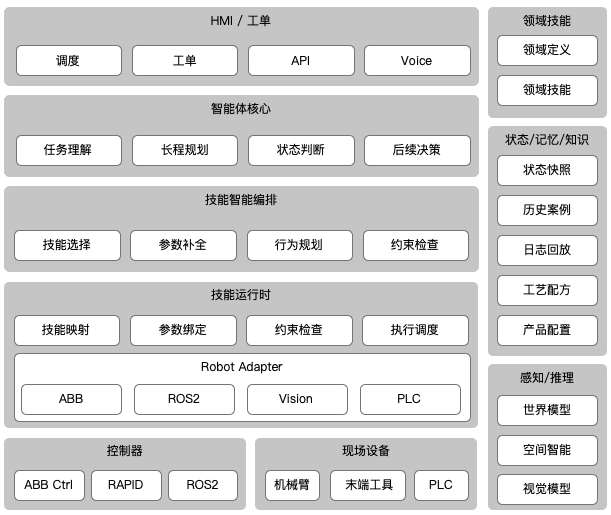

# AI-first 柔性制造探索，第 7 章：具身智能里的 Agentic AI 能力与组成

摘要：这一章顺着功能架构图往下拆。只有把每个框各自负责什么讲清楚，`Agentic AI` 该放在哪里。还包括一套更基础的软件架构问题：能不能通过组件化、模块化、可重用、可组合和职责分离，把关注点真正拆开。只有这样，系统才有机会在复杂现场里持续扩展，而不是在第一个场景跑通后就迅速失控。

## 先看图



`Agentic AI` 不是一个单点模型，它也不直接接管机械臂控制，它是一套把任务理解、状态判断、技能编排和工业执行串起来的系统

先从上到下看：

* 任务和交互入口：`HMI / 工单`
* 智能决策中枢：`智能体核心` 与 `技能智能编排`
* 执行落地层：`技能运行时` 与 `Robot Adapter`
* 工业执行层：`控制器` 与 `现场设备`

右侧有三类横向支撑：

* 领域技能
* 状态/记忆/知识
* 感知/推理

## 问题定义

这一章的核心问题是：在一个复杂的具身系统里，`Agentic AI` 的能力应该是什么样子的，应该放在哪一层，和其他层又是什么关系。

* 当任务通过 `HMI`、工单系统、`API` 或语音进入时，系统如何理解“现在要做什么”
* 当现场状态不断变化时，系统如何判断“现在处于什么阶段”
* 当一个动作要真正落到 `ABB`、`ROS2`、视觉系统和 `PLC` 上时，系统如何保证输出不是一句模糊建议，而是一个可以执行、可以约束、可以回执的动作请求
* 当系统同时面对多类设备、多种控制栈和不断增长的工艺变化时，架构如何控制复杂性、吸收异构性，并给后续扩展留出空间

从架构角度看，这里还有一组很实际的问题不能跳过：

* 系统边界怎么切，才能把任务理解、技能编排、运行时、适配层和控制执行拆开
* 哪些能力应该做成可复用组件，避免每接一类设备、每换一个工位就重写一遍
* 组件之间靠什么组合，才能既支持当前场景，又不把后续扩展锁死
* 职责如何分离，才能让规则、状态、感知、执行和回执各自演进

## 先固定一个贯穿全文的任务

后面都用一个固定任务往下走，把入口、判断、编排、执行和回流串成同一条链：

```text
任务：插入 FPC 排线
异常：第一次插入失败，视觉发现偏移 0.3 mm
系统决定：低速重拍 -> 二次对准 -> 再插一次
```

这个例子正好会经过图里最重要的几条链：

* 任务入口
* 当前状态判断
* 感知结果回流
* 技能选择与参数补全
* 运行时下发
* 控制器和现场设备执行

## 按图逐层解释

下面按分层顺序往下走，从任务入口开始，经过决策、编排和执行，最后回到状态回流。

## 1. HMI / 工单：任务从哪里进入系统

任务先从入口层收口。上层请求要先变成结构化任务，后面的判断和编排才有东西可用。

工程上，这里多半就是 `Web HMI + API 服务 + 消息队列`。重点不在界面多复杂，而在于尽快把工单、调度和人工输入收成统一任务对象。

图的最上层是 `HMI / 工单`，上层输入从这里进来：

* `调度`
* `工单`
* `API`
* `Voice`

这一层定义的是任务入口。输入来源、任务上下文和约束条件都要在这里落成结构化对象。

不同入口对应不同的真实场景：

* `调度` 对应上位调度系统、站间任务分发、车队协同
* `工单` 对应 `MES`、工单系统、配方切换、生产任务开始和结束
* `API` 对应系统间集成接口，例如上层业务系统直接下发请求
* `Voice` 对应人工口头指令、班组长交互或运维确认

到这一步，系统还没开始推理，先把外部输入收成：

* 任务目标
* 任务上下文
* 优先级
* 来源身份
* 当前约束条件

放到 `FPC` 插入这个例子里，入口层收到的不会是一句“帮我插一下排线”，而是一份结构化请求，例如：

* 当前工单要求执行 `FPC` 插入工步
* 当前产品型号是某一类手机主板
* 当前工位是精密插装单站
* 当前失败后允许最多一次自动恢复

## 2. 领域技能：哪些能力来自行业和工艺

领域扩展层不做通用推理，主要任务定义行业规则、工艺边界和专用技能。

落地时，`领域定义` 适合用 `YAML/JSON` 配置，加上版本管理和数据库维护；`领域技能` 更像技能注册表，一般也是配置加数据库，用来管理技能参数、前置条件和恢复路径。

`领域定义` 说清楚的是：

* 这个系统服务的是哪一类业务
* 任务对象是什么
* 成功和失败如何定义
* 工艺边界、站点边界和角色边界是什么

`领域技能` 则把下面这些内容固定下来：

* 在这个领域里，系统到底能做哪些受限动作
* 针对某类料号、工艺、设备，允许调用哪些专用工具和策略

在固定工位里，常见内容包括：

* 工艺步骤定义：把一项制造任务拆成可执行工步，例如取料、定位、插入、压合、检测和回位，并明确每一步的输入、输出和完成判据。
* 夹具和治具规则：说明夹具什么时候必须锁紧、哪种产品该用哪套治具、治具切换后要做哪些确认，以及未满足条件时哪些动作不能执行。
* 产品家族和料号规则：把不同产品型号、变体和零件编号的差异收进规则里，系统才能知道这次任务对应哪套参数、哪种技能和哪条工艺路径。
* 视觉检测工具链：指固定工位里会用到的视觉能力集合，例如定位、对位、缺陷检测、尺寸测量和结果判定，以及这些能力各自服务哪个工步。
* 异常恢复模板：把常见故障和处理路径预先定义出来，例如插入失败后是重拍、重试、回安全位还是转人工确认，避免系统每次都从头推一遍。

换到移动机器人场景，更常见的是：

* 地图语义：不是只有一张可导航地图，而是要给地图里的区域、工位、通道、电梯口、禁入区和装卸点加上业务含义，系统才知道“去 A 点”和“去装配线补料”不是同一种任务。
* 区域通行规则：不同区域往往有不同约束，例如哪些时段允许通行、哪些区域需要减速、哪些门禁要先申请联动、哪些通道只能单向走。
* 跨站搬运模板：指一类可复用的任务模板，例如“从仓储区取料 -> 送到装配站 -> 等待回执 -> 返回待命点”，它把多站点之间常见的搬运流程预先定义好。
* 电量和任务优先级策略：移动机器人不能只看当前任务，还要同时判断剩余电量是否够执行、是否要先回充，以及多个任务并发时谁应该先做、谁可以延后。

这一层决定了核心架构还能不能复用。行业知识如果直接写进核心，系统很快就会绑定在某个工位、某类产品或某套设备上。

放到 `FPC` 插入这个例子里，`领域定义` 会说明“插入成功”的判据是什么，`领域技能` 会说明当前工位允许的恢复动作可能只有：

* 低速重拍
* 二次对准
* 再插一次
* 回安全位
* 转人工确认

## 3. 智能体核心：系统在这里形成“理解”和“判断”

智能体核心负责任务理解、阶段判断和后续决策，但执行权不在这里。

首版实现更适合用 `大语言模型 + 领域技能`。`LLM` 负责理解任务、整理上下文、生成候选决策，`领域技能` 负责把可执行能力、工艺边界和恢复路径收成受限集合。

智能体核心真正起作用的是：

* `任务理解`
* `长程规划`
* `状态判断`
* `后续决策`

这一层就是 `Agentic AI` 的决策核心。

### 3.1 任务理解

`任务理解` 把入口层送来的请求翻成系统内部可操作的目标。

先要弄清楚几件事：

* 用户说的是什么任务
* 任务属于哪个模板
* 当前任务和历史上下文怎么关联
* 任务完成判据是什么

缺了这一层，系统只能接事件，形成不了任务语义。

放到这个例子里，`任务理解` 会把请求识别成“精密插装任务中的插入步骤”，而不是泛泛地把它当成一次抓取失败或一次普通视觉偏差。

### 3.2 长程规划

`长程规划` 说的是任务级规划，不是底层轨迹规划。

它关心的是：

* 这件事大致应该分成哪些阶段
* 当前阶段之后有哪些候选路径
* 遇到异常时应往哪条高层恢复链路走

例如：

* 是继续当前工步
* 是切到恢复流程
* 是回安全位后重进任务
* 是转人工确认

这里的“长程”说的是任务级，不是连续控制。

放到这个例子里，`长程规划` 关心的不是末端执行器怎么走轨迹，而是当前该走哪条恢复链：

* 直接重插
* 先重拍再对准
* 回安全位后重来
* 转人工确认

### 3.3 状态判断

`状态判断` 在具身场景里经常被低估，但它直接决定后续路径站不站得住。

它要回答的是：

* 现在系统到底处于什么状态
* 当前异常属于哪个阶段
* 当前设备和物料条件是否允许继续
* 当前风险是工艺风险、设备风险，还是节拍风险

状态判断不稳，后面的建议和恢复策略都会失真。

放到这个例子里，`状态判断` 要给出类似这样的结论：

* 当前阶段是“首次插入失败后的恢复阶段”
* 偏移量为 `0.3 mm`
* 还没超过自动恢复上限
* 当前更像对位偏差，不像机械故障

### 3.4 后续决策

`后续决策` 给出下一步建议，但这里的“决策”不是自由生成底层动作。

它输出的更像是：

* 下一步优先推荐的技能类别
* 需要补充什么参数
* 是否要请求新的感知结果
* 是否应直接触发人工确认

边界很明确：

* 它可以决定方向
* 但它不应直接越过下层去控制设备

放到这个例子里，`后续决策` 给出的不应是底层轨迹，而应是：

* 优先建议 `低速重拍`
* 如重拍后偏差仍可补偿，则执行 `二次对准`
* 然后再尝试一次插入

## 4. 状态/记忆/知识：系统为什么不会只看当前一帧

这一层是状态和知识底座，负责把当前状态、历史经验和工艺配置稳定送回决策链。

落地上，这一层通常是 `事务型数据库 + 日志存储 + 对象存储` 的组合。状态快照、工艺配方和产品配置先结构化落库，历史案例和日志回放再逐步补强检索能力。

图右侧第二列是 `状态/记忆/知识`，底座主要包括：

* `状态快照`
* `历史案例`
* `日志回放`
* `工艺配方`
* `产品配置`

这一部分提供的是连续上下文，不只是当前一帧的信息。

### 4.1 状态快照

`状态快照` 是当前时刻的结构化系统状态，例如：

* 当前工步
* 当前任务阶段
* 当前异常码
* 当前视觉结果
* 当前机器人模式
* 当前重试次数

### 4.2 历史案例

`历史案例` 不是普通日志，而是带结果、能比较的经验沉淀。

它的价值是：

* 当前问题能不能匹配到相似历史
* 哪条恢复路径曾经成功
* 哪类料号或工艺容易在什么阶段失败

### 4.3 日志回放

`日志回放` 则把复盘这件事落到了实处。

它让团队能回答：

* 当时系统看到了什么
* 为什么选了这条路径
* 这次失败到底是感知错、判断错，还是执行错

### 4.4 工艺配方

`工艺配方` 决定的是参数边界和工艺资格。

例如：

* 某个料号允许的偏差范围
* 某个工步的速度、力度、等待条件
* 某类恢复动作是否允许在本工位执行

### 4.5 产品配置

`产品配置` 决定的是产品和任务模板的差异。

例如：

* 产品版本
* 零件组合关系
* 工位是否启用某类功能
* 当前部署现场有哪些可用设备

这一列合起来，作用是把任务、工艺和历史背景稳定送回决策链。

放到这个例子里，一份有用的 `状态快照` 至少会包含：

* 当前工步：`FPC` 插入
* 首次插入结果：失败
* 视觉偏移：`0.3 mm`
* 当前恢复次数：`0`
* 当前产品配置：对应哪一类主板和排线型号
* 当前工艺配方：允许的补偿范围和二次插入速度

而 `历史案例` 和 `日志回放` 则帮助系统回答：以前出现 `0.3 mm` 左右偏移时，走“低速重拍 -> 二次对准 -> 再插一次”是否成功率更高。

## 5. 技能智能编排：把“想做什么”收成“准备用什么技能做”

从技能编排层开始，自由度才真正被收紧。上层建议会在这里被收成受限技能、明确参数和可执行流程。

这一层最适合用 `技能注册表 + 规则引擎 + 行为树/状态机` 落地。对机器人场景来说，`行为树` 往往比通用工作流更贴近执行编排，尤其适合条件分支、回退和恢复。首版重点也不在“规划得多聪明”，而在技能边界、参数来源和恢复路径能不能稳住。

图中央第三层是 `技能智能编排`，主要收敛发生在这里：

* `技能选择`
* `参数补全`
* `行为规划`
* `约束检查`

它位于智能体核心和技能运行时之间，把建议收成受限技能和可执行流程。

### 5.0 技能到底长什么样

前面一直在提“技能”，这里先把它写实一点。

在这张架构图里，技能不是一句自然语言命令，也不是一段临时生成的动作文本。一个能编排、能执行、能回执的技能，至少要有这些字段：

* `skill_id`
* 输入参数
* 前置条件
* 成功条件
* 失败条件
* 可调用的 `Adapter`
* 可选恢复路径

少了这些字段，所谓“技能”很容易退化成：

* 一个模糊的动作名称
* 一段无法验证的提示词
* 一次无法回放的临时调用

更实际一点，技能对象通常会长成这样：

```json
{
  "skill_id": "insert_fpc",
  "requires": [
    "fixture_locked",
    "vision_ok"
  ],
  "inputs": {
    "target_pose": "slot_3",
    "speed": "slow"
  },
  "success": "force_curve_ok && offset < 0.05mm",
  "failure": [
    "offset >= 0.05mm",
    "force_curve_abnormal",
    "timeout"
  ],
  "adapters": [
    "ABB",
    "Vision",
    "PLC"
  ],
  "recover": [
    "retry_with_realign",
    "manual_confirm"
  ]
}
```

放到本文的 `FPC` 插入例子里，这个定义的意思是：

* `skill_id` 说明当前调用的是哪一个稳定技能，而不是一段临时动作描述
* `requires` 说明夹具必须锁紧、视觉必须可用，否则根本不允许进入执行
* `inputs` 说明这次插入的目标位、速度和相关参数
* `success` 和 `failure` 说明运行时与回执层如何判断这次动作到底成没成功
* `adapters` 说明这个技能会调用哪些底层接口
* `recover` 说明失败后允许走哪些恢复路径

这样写完，`技能智能编排` 和 `技能运行时` 的关系就清楚了：

* 编排层决定“选哪个技能、补哪些参数、走哪条恢复路径”
* 运行时负责“把这个技能对象映射到真实控制接口，再把结果拿回来”

### 5.1 技能选择

`技能选择` 把上层给出的后续决策映射成具体技能类别。

例如，它要判断：

* 当前更适合调用“重拍”还是“低速重抓”
* 当前应走“复位”还是“转人工”
* 当前任务应选固定工位技能还是移动作业技能

### 5.2 参数补全

`参数补全` 把技能执行所需的参数拼齐。

例如：

* 目标工位
* 抓取姿态
* 容差范围
* 速度和力度配置
* 当前配方版本

没有这一步，技能只是个名字，无法执行。

### 5.3 行为规划

`行为规划` 可以直接理解成行为树编排。走到这里，系统不再只是决定“用哪个技能”，而是把技能、条件检查、恢复动作和 fallback 组织成一棵能执行的树。

在机器人场景里，行为树之所以合适，是因为它天然适合表达这些结构：

* 顺序执行
* 条件判断
* 重试与回退
* 感知失败后的重新观察
* 主路径失败后的恢复分支

放到本文的 `FPC` 例子里，一棵典型行为树大致是这样：

* 先检查夹具和视觉前置条件
* 执行 `低速重拍`
* 如果偏差仍在可补偿范围内，执行 `二次对准`
* 然后尝试 `再插一次`
* 如果再失败，就转到 `回安全位` 或 `人工确认`

高层建议到这里，会被收成一棵可执行的行为树，而不是一串线性动作列表。

边界还得再说清楚一点：`技能智能编排` 输出的不是“下一条命令”，而是一棵带节点状态、前置条件和恢复分支的行为树实例。到了运行时，真正被执行的是树里的叶子节点；运行时根据节点返回的 `success / failure / running` 持续 tick 整棵树，再决定下一步走主路径、重试分支还是 fallback。

### 5.4 约束检查

这里第一次出现 `约束检查`。

这个 `约束检查` 更偏决策前检查，用来判断：

* 当前技能是否被允许
* 当前参数是否在工艺范围内
* 当前阶段是否允许自动执行
* 是否必须先走人工确认

这一层还没进到底层运行时，但允许的动作空间已经收紧了。

放到这个例子里，抽象建议会在这里收成一个受限方案：

* `技能选择` 选中 `低速重拍`
* `参数补全` 补齐视觉曝光参数、相机位姿、二次插入速度、允许补偿上限
* `行为规划` 形成 `重拍 -> 重新计算偏差 -> 二次对准 -> 再插一次`
* `约束检查` 判断 `0.3 mm` 是否仍在可恢复范围内，以及当前是否允许自动重试

## 6. 感知/推理：系统如何理解物理世界

再往下是感知与推理层。它负责把视觉、空间关系和状态演化结果翻成决策可用的事实。

落地时，`视觉模型` 和 `空间智能` 往往优先于“通用世界模型”。前两者可以基于工业视觉、标定、位姿解算和几何约束先做起来，世界模型首版更适合先做成结果预测器。

图右下角是 `感知/推理`，这里承担的是：

* `世界模型`
* `空间智能`
* `视觉模型`

这一部分负责把现场观测转换成决策可用的物理状态。

### 6.1 视觉模型

`视觉模型` 负责把图像和传感器信息变成结构化结果。

例如：

* 目标是否存在
* 姿态是否偏移
* 装配结果是否通过
* 当前环境里有哪些障碍、遮挡或异常状态

### 6.2 空间智能

`空间智能` 在视觉结果之上进一步回答：

* 还能不能抓
* 能不能放
* 有没有可达性问题
* 当前补偿是否还在可接受范围

它比纯视觉更接近执行条件。

### 6.3 世界模型

`世界模型` 关注的是状态如何演化。

它的价值不在抽象描述，而在于：

* 如果执行这个动作，下一步大概率会怎样
* 当前状态会不会继续恶化
* 某条恢复路径的后果是什么

在这张图里，它属于推理支持层，而不是直接执行层。

放到这个例子里：

* `视觉模型` 识别到插入失败后排线端头偏移了 `0.3 mm`
* `空间智能` 判断这个偏移还能否通过二次对准补回来
* `世界模型` 评估“直接再插一次”失败概率较高，而“低速重拍后再插”更稳

## 7. 技能运行时：把编排结果落到系统接口

技能运行时不再做高层判断，它做的是把编排结果稳定落到底层接口。

工程上，这里通常会做成独立运行时服务，输入是技能对象或动作对象，输出是结构化回执。调度、超时、重试和失败上抛都在这一层收口。

如果上一层输出的是行为树，那么这一层就是行为树执行器：维护树状态、tick 当前节点、执行叶子技能、消费回执，再把节点状态回写到树上。编排层决定“长成什么树”，运行时决定“这棵树怎么跑”。

图中央第四层是 `技能运行时`，执行链在这里真正落到接口：

* `技能映射`
* `参数绑定`
* `约束检查`
* `执行调度`

并且内部还嵌套了一层 `Robot Adapter`：

* `ABB`
* `ROS2`
* `Vision`
* `PLC`

这是整张图里最偏工程实现的一层。

### 7.0 Robot Adapter 和控制器之间到底传什么

写到这里，软件工程师通常会立刻追问一件事：

* `技能运行时` 和 `Robot Adapter` 之间传递的到底是什么

这件事说不清，整套架构就还停留在概念层。真正决定系统能不能落地的，不是“有没有 Adapter”，而是：

* `Adapter` 接收的输入是否是稳定、结构化、可验证的动作对象

边界先说清楚：

* `Robot Adapter` 不接收自然语言
* 它也不直接接收高层任务描述
* 它接收的是结构化动作对象，也可以叫动作协议对象

这个对象的作用，是把上层技能编排结果压成一份面向执行接口的统一描述。至少要包含：

* `action_id`
* `action_type`
* 目标对象或目标位姿
* 约束参数
* 前置条件
* 成功判据
* 超时和失败策略
* 目标 `Adapter`

例如，针对本文的 `FPC` 插入恢复流程，运行时发给 `Robot Adapter` 的对象可以长成这样：

```json
{
  "action_id": "act_insert_fpc_retry_02",
  "action_type": "insert_with_realign",
  "target": {
    "station": "cell_01",
    "slot": "fpc_slot_3",
    "target_pose": "slot_3_realign_pose"
  },
  "constraints": {
    "speed": "slow",
    "max_offset_mm": 0.3,
    "force_profile": "fpc_insert_profile_a"
  },
  "preconditions": [
    "fixture_locked",
    "vision_ok",
    "plc_interlock_released"
  ],
  "success": {
    "offset_lt_mm": 0.05,
    "force_curve_ok": true
  },
  "timeout_ms": 2500,
  "on_failure": [
    "retry_with_realign",
    "manual_confirm"
  ],
  "adapter": "ABB"
}
```

这个对象和前面提到的技能对象不完全一样：

* 技能对象描述“系统允许做什么”
* 动作对象描述“这一次具体怎么做”

前者更像任务编排语言，后者更像执行协议语言。

从工程实现看，这一层往往也是整套系统里最费工的部分。不是因为算法最复杂，而是因为它卡在两边：上面接统一动作对象和行为树执行状态，下面接 `ABB`、`ROS2`、视觉系统和 `PLC` 的真实接口，中间还要处理参数翻译、协议差异、超时、互锁、异常码和回执标准化。很多项目最后拖慢进度的，不是模型，而是这一层一直没收敛。

更稳的做法不是写一个“大 Adapter”，而是拆成几块：

* 动作协议层：定义统一动作对象和统一回执对象
* 运行时执行层：负责 tick 行为树、下发叶子节点、接收回执、更新节点状态
* Adapter 接口层：定义 `ABB`、`ROS2`、`Vision`、`PLC` 的最小调用契约
* 协议翻译层：把统一动作对象翻译成 `RAPID`、`ROS2 action`、视觉调用、`OPC UA/Modbus`
* 设备回执归一层：把不同厂商、不同设备返回的结果整理成统一状态对象

这样拆的好处很直接：

* 上层先把动作协议定住
* 中间把执行器和适配器解耦
* 下层设备差异被隔离在各自的翻译层里

不这样拆，行为树执行、协议转换、设备异常和回执处理很容易缠在一个服务里，后面几乎没法维护。

### 7.1 技能映射

`技能映射` 负责把上层的技能名，映射成具体系统中的动作实现。

例如：

* “回安全位”映射到哪段 `RAPID` 例程
* “重拍”映射到哪个视觉触发接口
* “跨站搬运”映射到哪类导航任务

### 7.2 参数绑定

`参数绑定` 把上层给出的参数绑定到具体控制接口的字段格式。

这里做的是接口级翻译，例如：

* 上层的目标姿态转成控制器参数
* 上层的工艺容差转成视觉系统阈值
* 上层的任务标识转成 `PLC` 或站控可识别字段

### 7.3 约束检查

图里第二次出现 `约束检查`。

这里的 `约束检查` 和上层编排阶段不一样，更偏执行前检查：

* 控制器是否在线
* 当前设备状态是否允许下发
* 参数是否满足接口和安全前置条件
* 当前互锁是否解除

换句话说：

* 编排层的 `约束检查` 决定“逻辑上该不该做”
* 运行时的 `约束检查` 决定“现在能不能发出去”

### 7.4 执行调度

`执行调度` 负责组织调用顺序、超时、并发和回执。

它要保证：

* 哪些命令先发
* 哪些命令等待结果再继续
* 超时后如何处理
* 失败后如何上抛

运行时稳不稳，很多时候就在这里见分晓。

### 7.5 Robot Adapter

`Robot Adapter` 是这套架构的接口隔离层。系统不直接耦合到底层硬件，而是通过适配层对接不同接口。

图里明确列出了四类适配对象：

* `ABB`
* `ROS2`
* `Vision`
* `PLC`

这样设计有几个直接结果：

* 上层能力可以尽量保持统一
* 不同现场的设备差异留给适配层处理
* 新设备、新接口、新控制栈的接入成本更可控

放到这个例子里，落到系统接口时，会被翻译成这样的请求：

* `技能映射` 把 `低速重拍` 映射成一次视觉重采集调用
* `参数绑定` 把 `0.3 mm` 容差、二次对准偏移量和低速插入参数写进控制字段
* `约束检查` 确认 `ABB` 控制器在线、视觉系统可用、`PLC` 互锁已解除
* `执行调度` 按顺序触发 `Vision -> ABB/RAPID -> Vision -> ABB/RAPID`

接着，`Robot Adapter` 会把这些调用分别转成：

* 给 `Vision` 的重拍请求
* 给 `ABB` 或 `RAPID` 的二次对准和再插动作
* 给 `PLC` 的互锁确认或工步切换信号

这里做的不是“把一句建议发给机器人”，而是：

* `Robot Adapter` 先接收结构化动作对象
* `ABB Adapter` 再把它翻译成 `RAPID` 例程调用、控制器参数或厂商接口请求
* `PLC Adapter` 再把它翻译成 `IO`、`OPC UA`、`Modbus` 或站控字段更新
* `Vision Adapter` 再把它翻译成具体视觉触发、重采集或检测调用

只有把这层定义清楚，`技能运行时 -> Robot Adapter -> 控制器` 才是一条能实现的软件接口链，而不只是示意图。

## 8. 控制器与现场设备：真正执行发生在哪里

到了执行边界，控制器运行已验证的控制逻辑，现场设备把动作真正做出来。

落地原则很简单：控制器沿用现有工业控制栈，现场设备继续由自动化系统接管，上层不要越过这条边界。真正要补的是标准接口和回执，不是重写控制器。

图的最底层一边是控制，一边是设备：

* `控制器`
* `现场设备`

这两边得分开看。

### 8.1 控制器

`控制器` 这一侧挂着：

* `ABB Ctrl`
* `RAPID`
* `ROS2`

这里承载的是设备控制逻辑本身。它负责：

* 执行已验证控制程序
* 管理底层动作逻辑
* 处理底层回执和状态

这部分不该被上层智能体替代。

### 8.2 现场设备

`现场设备` 这一侧对应的是：

* `机械臂`
* `末端工具`
* `PLC`

再往下就是物理世界本身。动作有没有真的发生，工艺有没有真的成功，传感器有没有真的返回正确状态，最后都在这里见分晓。

所以这套架构必须把“建议”“编排”“运行时”“控制器”“设备”分开。它们面对的是不同的可靠性要求。

放到这个例子里，真正发生的事情是：

* `ABB Ctrl` 和 `RAPID` 执行低速对准和再插动作
* 视觉系统重新拍照并回传更新后的偏差
* `机械臂` 和 `末端工具` 完成二次插入
* `PLC` 返回工步完成或失败状态

直到这一步，任务才真正从“系统建议”变成“现场结果”。

## 9. 回执回流：执行不是单向下发，而是闭环

这里把执行回流主线补完整。系统不是一次性下发动作就结束，而是根据回执不断更新状态，再做下一轮决策。

实现上，这条链通常依赖统一回执对象和事件流。执行结果先写回状态快照，再触发下一轮状态判断和后续决策，闭环才成立。

如果只看到上面的分层，读者很容易把它理解成一条从上往下的流水线：

* 任务进来
* 系统做判断
* 系统下发动作
* 现场执行结束

真实系统不是单向下发，它一直在闭环里跑。

更接近真实情况的主线是：

```text
技能运行时
-> Robot Adapter
-> ABB / Vision / PLC 执行
-> 返回结构化回执
-> 状态快照更新
-> 状态判断重新计算
-> 后续决策选择下一步
```

换句话说：

* 执行结果不只是写进日志
* 它会回流成新的状态输入
* 新状态会再次进入 `状态判断` 和 `后续决策`

这条回流链是持续决策能力成立的前提。

从架构上看，回流会经过下面这些环节：

* `控制器` 和 `现场设备` 返回执行结果
* `Robot Adapter` 把厂商接口回执翻译成统一结果对象
* `技能运行时` 把结果对象写回执行状态
* `状态/记忆/知识` 更新 `状态快照`、`日志回放`、必要时沉淀 `历史案例`
* `智能体核心` 基于新状态再次做 `状态判断` 与 `后续决策`

这意味着这套系统不是“一次下发，一次结束”，而是：

* 下发
* 执行
* 回执
* 更新状态
* 再决策

放到本文的 `FPC` 插入恢复例子里，一次典型闭环可以长成这样：

```text
技能运行时
-> ABB 执行二次对准
-> Vision 返回 offset = 0.18 mm
-> 运行时记录 retry = 1
-> 状态快照更新
-> 状态判断认为仍在可恢复范围内
-> 后续决策继续选择“低速重试”
```

如果下一次回执变成：

* `offset = 0.42 mm`
* `retry = 2`
* `force_curve_abnormal = true`

那么同样一条闭环会导向完全不同的结果：

* `状态判断` 会把它识别为高风险恢复阶段
* `后续决策` 不再选择自动重试
* `技能智能编排` 会转向 `回安全位` 或 `人工确认`

`历史案例` 和 `日志回放` 的价值也不只是事后复盘，它们先服务于在线闭环：

* 当前执行结果先回到状态里
* 状态更新后，系统才有资格决定下一步

所以这张架构图描述的，是一个持续决策系统，不是一次性流水线。

## 10. 架构如何收束成一个可落地系统

最后把前面的模块重新收束一下，看看每一层为什么存在，又是怎么接起来的。

最上层的 `HMI / 工单` 负责提出任务；  
`领域技能`、`状态/记忆/知识`、`感知/推理` 负责补足任务语义、历史上下文和现场事实；  
`智能体核心` 负责形成任务理解、阶段判断和下一步建议；  
`技能智能编排` 负责把建议收成受限技能与可执行流程；  
`技能运行时` 与 `Robot Adapter` 负责把这些流程翻译成真实接口调用；  
`控制器` 与 `现场设备` 则负责把动作真正执行出来，并返回结果。

这张图不是把所有能力堆在一起，而是在做几次收敛：

* 从开放任务收敛到结构化任务
* 从开放建议收敛到受限技能
* 从受限技能收敛到底层控制接口和物理执行

所以图里必须同时保留这些层：

* `智能体核心`
* `技能智能编排`
* `技能运行时`
* `控制器`
* `现场设备`

这些层不能压成一个模块，因为它们面对的问题根本不同：

* `智能体核心` 解决理解与判断
* `技能智能编排` 解决技能边界与流程组织
* `技能运行时` 解决系统接口与执行调度
* `控制器` 解决底层控制程序的可靠执行
* `现场设备` 解决真实物理动作是否发生

右侧这些支撑面也不是附属信息，而是架构成立的前提：

* 没有 `领域技能`，系统不知道在特定行业里哪些动作和规则是有效的
* 没有 `状态/记忆/知识`，系统无法带着历史上下文工作
* 没有 `感知/推理`，系统无法把真实现场转成可判断状态

从架构设计角度看，这张图真正说明的是：

* 上层负责理解、判断、编排和调度
* 下层负责控制、执行和回执
* 中间通过技能对象、参数、约束和适配器把两者接起来

如果换成软件架构语言，这套分层还有另一层意义：它不是只在描述一条执行链，也是在定义一套组件体系。`HMI / 工单` 是任务入口组件，`领域技能` 是领域能力组件，`状态/记忆/知识` 是状态与配置组件，`技能智能编排` 和 `技能运行时` 共同构成可组合的执行骨架，`Robot Adapter` 则是隔离异构设备的接口组件。这样切的价值很直接：

* 同一套运行时和编排骨架可以复用到不同工位
* 新工艺优先表现为新增技能或约束，而不是重写整条链
* 新设备优先表现为新增 Adapter，而不是改动上层决策逻辑
* 各层可以独立演进，避免感知、规则、执行和控制彼此缠死

所以这里讲的“分层”，本质上也是“模块化”和“关注点分离”。只有把系统做成一组可替换、可复用、可组合的组件，柔性制造里的复杂性和异构性才不会一路向上蔓延，最后把智能体核心也拖成一个巨型模块。

这也是它适合柔性制造首版系统的原因：既能把 `Agentic AI` 引进来，又不要求系统一上来就越过控制器和工业安全边界。

## 11. 最值得先验证什么

首版实现不该平均铺开，先验证最容易决定成败的几个接口和闭环：

1. `HMI / 工单` 的输入能不能稳定收成结构化任务包，而且这个任务包能不能被后续模块复用。
2. `状态快照`、`工艺配方`、`产品配置` 能不能组成稳定上下文，并和决策层、编排层解耦。
3. `技能选择`、`参数补全`、`行为规划` 能不能收成固定技能接口，让技能真正可组合、可复用。
4. `技能运行时` 到 `Robot Adapter` 的接口能不能稳定映射到现场控制栈，并支持后续扩展新设备而不改上层逻辑。
5. 底层回执能不能回流成 `历史案例` 与 `日志回放`，同时保持统一回执格式，别让不同设备把状态层打散。

如果把这五项换成一句更硬的架构判断，其实就是在验证三件事：

* 组件边界是不是清楚
* 组件之间的契约是不是稳定
* 新场景接进来时，系统到底是在“扩展组件”，还是又回到“改一个大模块”

这五件事一旦打通，这张图就不只是架构图了，而会开始变成真实系统。

## 12. 下一步

下一步不必继续扩概念，挑一个具体场景，用这张图走通一次最小闭环。比较合适的切入点通常是：

* 异常分流
* 位姿补偿建议
* 非关键工步策略选择
* 换型准备辅助

这些场景有一个共同点：

* 足够需要 `任务理解`、`状态判断` 和 `后续决策`
* 又不会要求 `Agentic AI` 直接进入毫秒级底层控制闭环

这正是这张功能架构图最适合服务的产品边界。

## 继续阅读

* 返回索引：[AI-first 文章索引](./abb-isaac-agent-flexible-manufacturing-ai-first-index.md)
* 上一章：[第 6 章：6 个典型场景展开](./abb-isaac-agent-flexible-manufacturing-ai-first-index.md#第-6-章场景展开)
* 下一章：[第 8 章：从仿真、数据、世界模型到受限真机](./abb-isaac-agent-flexible-manufacturing-ai-first-08-sim-data-worldmodel-to-real.md)
