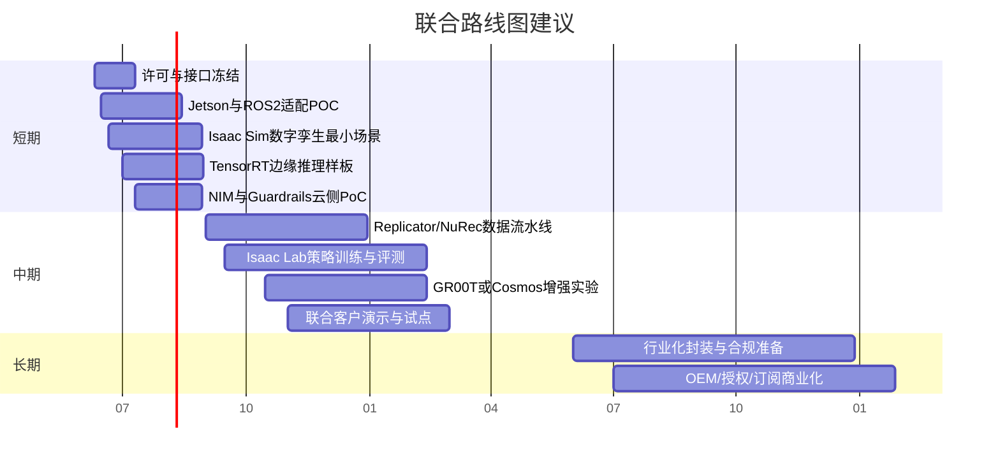

# NVIDIA 与具身智能领域的产品版图

## 执行摘要

截至 2026 年 6 月，NVIDIA 在“AI Agent + 具身智能 + 物理 AI”方向已经形成了相对完整的分层技术栈：上层是 Agent 编排、检索、治理与安全层，代表产品包括 NeMo Agent Toolkit、AI-Q Blueprint、NeMo Guardrails、NeMo Relay、NIM 与 NemoClaw；中层是多模态模型、语音、视觉与推理优化层，代表产品包括 NIM for LLM/VLM、Riva/Speech NIM、TAO、TensorRT-LLM、TensorRT 与 Triton；下层是仿真、数字孪生、合成数据、机器人学习与边缘部署层，代表产品包括 Isaac Sim、Isaac Lab、Isaac ROS、Isaac GR00T、Omniverse Replicator、Omniverse NuRec、Cosmos、JetPack/Jetson、DeepStream、Holoscan 以及 DRIVE。整体上，NVIDIA 的强项不是替代“具身智能大脑”本身，而是提供训练基础设施、仿真环境、加速推理、边缘部署、语音交互与安全治理能力。

对具身智能大脑而言，最有价值的合作路径并非与 NVIDIA 在“基础设施/加速层”正面重叠，而是把具身智能大脑定位为**任务语义、策略决策、实时控制与系统集成主脑**，把 NVIDIA 作为**仿真训练底座、感知与语音加速器、Agent 云边协同治理层、以及行业级边缘硬件平台**。在这种定位下，双方的重合主要集中在“策略学习/推理”和“多模态感知理解”两个环节；互补性最强的部分则是“OpenUSD/Omniverse 数字孪生 + Isaac Lab 训练 + TensorRT/Jetson 部署 + NIM/Guardrails/AI-Q 管理”。

从商务上看，最现实的三条路线分别是：其一，围绕 Isaac Sim/Isaac Lab/Replicator/NuRec 建立仿真到现实的数据与训练闭环；其二，把具身智能大脑部署到 Jetson/JetPack/Isaac ROS/TensorRT 的边缘实时栈中，形成“具身智能大脑 + NVIDIA 边缘底座”的 OEM 或联合参考设计；其三，在云边协同层面引入 NIM、AI-Q、NeMo Guardrails 与 NeMo Microservices，形成任务分解、策略评估、知识接入与安全治理的上层 Agent 控制平面。就优先级而言，短期最值得做的是 Jetson/Isaac ROS/Isaac Sim 三线并行的 POC，而不是一开始就押注 Cosmos/GR00T 的大规模模型再训练。

本报告采用的具身智能大脑假设为：**支持多模态感知、实时控制接口、策略学习/推理模块、ROS/自定义 SDK 接口**。下列信息均未指定，因此在涉及兼容性和工期时一律标注为“未指定/待核验”：具身智能大脑的目标硬件、实时控制周期、是否已有数字孪生、是否已有语音/视觉模型、是否面向医疗或车载监管场景、是否要求离线/本地私有化部署、以及是否已有 OpenUSD/ROS2 数据标准化。未指定项直接决定合作路径难度与优先级。  

## NVIDIA 在 AI Agent 与具身智能的软件与平台版图

说明：下表优先采用 NVIDIA 官方文档、官方 GitHub 仓库、NVIDIA Research 页面与官方博客。对采用 rolling docs 或 gated 发布模式、且公开页面未直接展开 SPDX 许可证的项目，标记为“待核验”，以避免误报。

### 机器人、仿真、世界模型与合成数据

| 产品/项目 | 功能简介 | 典型场景 | 技术栈 | 许可/开源地址 | 最新公开可核验版本与时间 | 主要依赖 |
|---|---|---|---|---|---|---|
| **Isaac Sim** | 基于 Omniverse 的机器人仿真平台，支持 URDF/MJCF/CAD 导入、GPU 物理仿真与 RTX 传感器渲染，用于开发、测试、训练和部署机器人。 | 数字孪生、仿真验证、传感器仿真、HIL/SIL | Omniverse Kit、GPU 物理、RTX 传感器、ROS 对接 | 开源代码仓库 `isaac-sim/IsaacSim`；代码层已开源，二进制分发仍受 NVIDIA 许可约束 | **5.1.0**；公开下载页标注 **2025 年 10 月**，GitHub GA 开源发布页创建于 **2026-03-16** | Linux x86_64/aarch64、Windows、NVIDIA GPU、容器/本地安装 |
| **Isaac Lab** | GPU 加速的机器人学习框架，统一 RL、模仿学习、运动规划与 sim-to-real 工作流。 | 机器人策略学习、跨 embodiment 泛化、强化学习 | 基于 Isaac Sim，整合并行物理、传感器仿真、数据采集与域随机化 | 开源仓库 `isaac-sim/IsaacLab`；具体 SPDX 公开摘要未展开，**待核验** | GitHub releases 的最新公开条目显示 **2025-12-04**；稳定版 **2.3 GA** 发布讨论为 **2025-10-30** | Isaac Sim 5.x、NVIDIA GPU |
| **Isaac ROS** | 面向 ROS 2 的加速库与“gems”，用于感知、定位、SLAM、图像处理等。 | 机器人边缘感知、ROS2 系统集成 | ROS 2 Humble、Jetson/GPU 加速、Isaac ROS GEMS | 开源仓库 `NVIDIA-ISAAC-ROS/isaac_ros_common`；许可证公开摘要未展开，**待核验** | **4.4.0**，发布于 **2026-05-01**；仓库说明有 **2026-04-30** 的兼容更新 | ROS 2、Jetson、Ubuntu、相机/雷达驱动 |
| **Isaac GR00T** | 面向通用人形/通用机器人技能的开放参考平台与 VLA 模型族，支持语言+视觉到动作。 | 人形机器人、双臂操作、通用技能迁移 | 视觉-语言-动作模型、后训练、Isaac Sim/Lab 评测 | 官方平台 `NVIDIA Isaac GR00T` 与仓库 `NVIDIA/Isaac-GR00T`；白皮书称“开放权重、宽松许可”，但具体模型/代码许可需按仓库与模型卡核验 | 仓库 README 显示 **N1.7 Early Access** 为最新；GitHub latest release 为 **n1.6.1-release**，时间 **2026-04-23** | 大规模 GPU、机器人轨迹数据、仿真环境 |
| **Omniverse Replicator** | 合成数据生成与域随机化工具，适合自动标注与大规模视觉数据生成。 | 检测/分割/姿态/感知模型训练 | Omniverse 扩展、USD 场景、随机化流水线 | 软件本体为 Omniverse 组件；示例/脚本可能开源，具体需按仓库核验 | **1.12.27**，文档公开时间 **2025-10-02** | Omniverse/Isaac Sim、RTX GPU |
| **Omniverse NuRec** | 从真实相机与激光雷达数据生成可用于 Physical AI 训练/测试的 3D 可模拟环境。 | 现实场景重建、数字孪生、仿真资产生成 | 神经重建与渲染、相机/激光雷达数据处理 | 文档与服务为 NVIDIA 平台能力；代码/模型许可依子组件而异 | 当前文档公开版本 **26.04**，时间 **2026-05** | 多视角图像/点云、较高 GPU/存储资源 |
| **Cosmos 平台** | 面向 Physical AI 的开放世界模型平台，包含 Reason、Predict、Transfer 等模型与数据/工具。 | 物理世界推理、合成视频、世界模型后训练、sim-to-real 感知桥接 | 世界基础模型、物理推理、视频/多模态生成 | 主平台与子仓库开放；**模型许可**与**代码许可**并不完全相同，官方论文明确提到 *NVIDIA Open Model License*，部分代码子仓公开为 Apache-2.0 | **Cosmos 3** 为最新前沿更新，官方博客时间 **2026-06-01**；主开源平台仓活跃 | 大规模 GPU、视频/仿真数据、后训练流水线 |

### Agent、模型服务、语音与治理

| 产品/项目 | 功能简介 | 典型场景 | 技术栈 | 许可/开源地址 | 最新公开可核验版本与时间 | 主要依赖 |
|---|---|---|---|---|---|---|
| **NeMo Agent Toolkit** | 跨框架的轻量级 Agent 库，用于把企业 Agent 接到数据源与工具链上。 | 企业 Agent、工具调用、知识接入 | Python 库、框架中立、工具与数据源适配 | 开源；安装名 `nvidia-nat`，但公开摘要未展开 SPDX，**待核验** | 官方 docs 未直接展示独立最新 tag；至少可核验 **AI-Q 2.0.0 changelog 已固定 NAT v1.6.0** | Python 环境、上层 Agent 框架 |
| **AI-Q Blueprint** | 企业级深度研究 Agent 蓝图，支持浅/深研究路由、异步作业、知识层、评测。 | 深度研究、企业知识代理、带引用报告生成 | NAT、LangGraph、DeepAgents、Web 前端、K8s/Helm | 开源仓库 `NVIDIA-AI-Blueprints/aiq`，**Apache-2.0** | **2.0.0**，发布于 **2026-03-18** | Python 3.11–3.13、Node.js 22+、可选 K8s、数据库 |
| **NeMo Guardrails** | 为 LLM/Agent 增加可编程护栏，覆盖内容安全、越狱检测、PII、话题控制、工具/输出 rail。 | Agent 安全治理、会话护栏、合规审计 | Python、Colang、异步执行、OpenTelemetry、LangChain 中间件 | 开源仓库 `NVIDIA-NeMo/Guardrails`，**Apache-2.0** | 仓库标注最新 released version 为 **0.21.0**；官方公告日期 **2026-03-12** | Python 3.10–3.13、外部或本地模型/NIM |
| **NeMo Relay** | 框架中立的 Agent runtime substrate，为作用域、middleware、plugin、观测和事件流提供统一执行语义。 | 复杂 Agent 运行时一致性、跨语言 runtime | Rust core + Python/Node.js 绑定、OTel/ATIF | 公共文档可见；具体开源许可公开摘要未展开，**待核验** | 官方文档显示 **v0.3.0** | 上层 Agent 框架、LLM provider、观测后端 |
| **NeMo Microservices** | 模块化平台，内含 Customizer、Evaluator、Data Designer、Guardrails、NIM Proxy、Studio 等。 | 数据飞轮、模型微调、评测、安全、企业私有化平台 | Kubernetes 原生微服务、API/Python SDK、数据库/对象存储 | 商业平台，EULA/AI Enterprise 体系 | 公开可见 release 为 **25.11.0** | K8s、PostgreSQL、Milvus、对象存储、NGC |
| **NIM for LLMs** | 自托管 LLM 推理微服务，支持 OpenAI 兼容 API、工具调用和 MCP 集成。 | 文本 Agent、企业推理服务 | vLLM、Docker、Helm、KServe、NIM Operator | 商业许可，受 *NVIDIA AI Product Agreement* 约束，不是开源软件 | **2.0.5**，公开文档时间 **2026-05-20**；另有 PB 分支 **2.0.4-pb6** | CUDA 12.9+、Driver 580+、Docker 24+、NVIDIA GPU |
| **NIM for VLMs** | 自托管视觉语言模型推理微服务，适合多模态 Agent 与视觉安全检查。 | 视觉问答、视觉安全、VLM Agent | vLLM、HTTP/Helm、LoRA、工具调用部分支持 | 商业许可，受 NVIDIA 产品协议约束 | 当前 latest 文档显示 **2.0.5-variant**，最后更新 **2026-06-03** | 大显存 GPU；个别模型冷启动与存储成本很高 |
| **Riva SDK / Speech NIM** | 语音 AI 能力：ASR/TTS/NMT。最新路线图表现为“嵌入式 Riva SDK + 数据中心 Speech NIM”。 | 机器人语音交互、实时转写与播报 | Triton、TensorRT、gRPC/HTTP/WebSocket | Riva SDK 为 NVIDIA SDK；Speech NIM 为商业微服务 | **Riva 2.24.0**（**2026-02-11**），**Speech NIM 26.02.0**（最后更新 **2026-04-20**） | Jetson/JetPack 7.0（最新嵌入式）；x86 数据中心转向 Speech NIM |
| **TAO Toolkit** | 低代码/脚本化模型微调与优化工具，便于将视觉基础模型适配到场景任务，并导出 TensorRT。 | 感知模型定制、边缘部署前优化 | Python、PyTorch/TensorFlow、TensorRT、NGC 容器 | TAO 核心网络自 **5.0.0** 起开源；教程/部署后端仓公开，`tao_deploy` 为 **Apache-2.0** | 当前文档可见 **6.26.3**，发布时间 **2026-04-01** | NVIDIA GPU、NGC 容器、训练数据集 |
| **NemoClaw** | 用于在 OpenShell 沙箱中更安全地运行“常驻型 AI agent”的开放参考栈。 | 云/本地/RTX PC/DGX Spark/Jetson 的安全 Agent 运行 | OpenShell、CLI、策略化网络与推理路由 | 开源仓库 `NVIDIA/NemoClaw` | 官方 release notes 显示早期预览自 **2026-03-16** 开始，当前可见版本 **v0.0.55** | Node.js、OpenShell、受管推理路由 |
| **NVIDIA Verified Agent Skills** | 面向 Agent 的可移植技能目录，提供扫描、签名、skill card 等治理链路。 | Agent 能力封装、平台工具调用、AI coding assistant | 技能目录、签名、扫描、信任流水线 | 开源仓库 `NVIDIA/skills`，目前**无打包 release**，按目录滚动更新 | 公开目录持续更新；官方博客发布时间 **2026-05-19** | 与上层 Agent runtime、技能安装机制集成 |

### 推理优化、边缘部署与垂直行业平台

| 产品/项目 | 功能简介 | 典型场景 | 技术栈 | 许可/开源地址 | 最新公开可核验版本与时间 | 主要依赖 |
|---|---|---|---|---|---|---|
| **CUDA Toolkit** | NVIDIA GPU 计算与 CUDA-X 生态基础。 | 训练、推理、算子开发、加速库底座 | CUDA、cuDNN、开发工具链 | NVIDIA 官方工具链，非开源软件栈整体 | **13.3.0**，**2026-05** | 驱动、GPU、Linux/Windows |
| **TensorRT** | 面向推理的图优化、量化与 engine 构建。 | 边缘/数据中心推理加速 | C++/Python、builder/runtime | NVIDIA SDK，非开源软件整体 | **11.0.0**，文档更新时间 **2026-05-27** | NVIDIA GPU、ONNX/框架模型 |
| **TensorRT-LLM** | 面向 LLM/VLM 的高性能推理框架。 | 高吞吐/低延迟本地大模型推理 | Python API、C++ runtime、`trtllm-serve` | 开源仓库 `NVIDIA/TensorRT-LLM`；公开摘要未展开 SPDX，**待核验** | 稳定文档 release 为 **0.21.0**（页面更新时间 **2026-05-25**）；GitHub 最新 tag 为 **v1.3.0rc17**（**2026-06-02**，RC） | NVIDIA GPU；Jetson/DRIVE 侧相关能力延伸到 Edge-LLM |
| **Triton Inference Server** | 多框架模型服务平台，支持 TensorRT、PyTorch、ONNX 等。 | 云边统一模型服务、推理编排 | 模型仓库、多后端、容器 | 开源仓库 `triton-inference-server/server` | 当前容器发布轨迹可见 **25.05**（**2026-05-27**）；GitHub 提示 **26.02** 是 Jetson 平台最后一个 GitHub 发行版说明 | GPU/CPU、容器/K8s |
| **JetPack / Jetson** | Jetson 官方软件栈，面向边缘 AI；JetPack 7 已明确“agentic-ready”。 | 机器人、工业、边缘推理、实时控制 | Jetson Linux、CUDA、TensorRT、多媒体、Isaac/DeepStream/Riva 上层 SDK | 整体受 NVIDIA 软件许可约束 | **JetPack 7.2**，页面时间 **2026-06**；集成 **Jetson Linux 39.2、CUDA 13.2.1、TensorRT 10.16.2** | Jetson Orin/Thor 模组与开发板 |
| **Jetson Platform Services** | JetPack 内置的模块化、API 驱动、云原生边缘服务。 | GenAI/视觉边缘应用、快速应用组装 | 容器化微服务、API、边缘平台服务 | 作为 JetPack 组成部分提供，非开源产品栈整体 | 文档可见 **version 2.0**，发布时间 **2026-01-23** | Jetson、JetPack 6.2（当前 release notes 可见支持） |
| **DeepStream SDK** | 面向流式视频与传感器 AI 的 SDK，官方已强调“vision agents and AI-powered video analytics”。 | 机器人视觉、视频智能、边缘感知 | GStreamer、TensorRT、Triton、Jetson/dGPU | **闭源 SDK**；官方说明仅部分参考应用和若干插件提供源码 | **9.0**，发布时间 **2026-04-14** | dGPU/X86、Jetson Thor、Ubuntu 24.04 |
| **Holoscan SDK / Clara 生态延续** | 超低时延流式传感器 AI 平台；HAP 规范扩展自 MONAI Deploy；Holoscan SDK 已从早期“Clara”前缀中抽象为 domain-agnostic。 | 医疗设备、工业检测、科学仪器、实时传感器处理 | GXF 后端、C++/Python、GPUDirect RDMA、HAP | 开源仓库 `nvidia-holoscan/holoscan-sdk`；Clara 品牌在 SDK 层已弱化，`docs.nvidia.com/clara` 当前更多指向 MONAI Toolkit/企业分发 | GitHub latest 为 **v4.3.0**（**2026-05-31**） | IGX/Jetson/RTX、传感器桥接、FPGA/高速网络 |
| **DRIVE AGX / DriveOS / DriveWorks** | 自动驾驶/车端 AI 平台，覆盖传感器集成、AI 加速、QNX/Linux、DriveWorks 模块。 | 车载/无人车/高可靠移动平台 | DriveOS、DriveWorks、TensorRT for Drive、Linux/QNX | Developer Program 与商业许可，公开资料具有门槛 | 公开可检索主文档中心聚焦 **DriveOS 7.0.3**；另有 Orin 线公告显示 **DriveOS 6.0.10 包含 DriveWorks 5.20** | DRIVE AGX Orin/Thor、开发者计划成员资格 |

## 研究论文、白皮书与能力边界

NVIDIA 在 Physical AI 的研究路线已经比较清晰：一条是**机器人学习与 VLA/VLM 行为模型**，代表是 Isaac Gym、Isaac Lab 与 GR00T；一条是**世界模型与物理推理**，代表是 Cosmos Platform、Cosmos Reason、Cosmos Transfer 与后续 Cosmos 3；第三条是**从现实世界到可训练虚拟世界的重建与高保真仿真**，代表是 NuRec、3D/4D Gaussian 类路线以及 Omniverse/Isaac Sim 的数字孪生管线。它们共同指向一个结论：NVIDIA 正在构造“世界模型 + 机器人模型 + 仿真平台 + 推理底座”的完整闭环，而不是只做单点加速库。

| 论文/白皮书 | 关键技术点 | 对协作的启发 | 明确的能力边界 |
|---|---|---|---|
| **Isaac Gym: High Performance GPU Based Physics Simulation For Robot Learning**（2021） | 以 GPU-native 并行物理仿真支撑大规模 RL 训练。 | 说明 NVIDIA 的机器人路线从一开始就把“仿真吞吐”作为核心壁垒；具身智能大脑若要做策略学习，最容易借力 NVIDIA 的就是训练吞吐与环境并行。 | Isaac Gym 已逐步被 Isaac Lab 接替；若现在启动合作，不宜基于 Gym 新建长期平台层。 |
| **NVIDIA Isaac GR00T N1 白皮书**（2025） | 使用人类第一视角视频、真实/仿真机器人轨迹和合成数据训练 VLA；在多 embodiment 仿真基准上优于 SOTA imitation baselines。 | 具身智能大脑若已有任务语义与执行接口，可把 GR00T 视为“通用技能初始化器/先验模型”，而不是成品控制器。 | 白皮书强调的是“通用技能与推理”，并未声称可直接替代确定性、可验证的实时控制栈。通常仍需后训练、控制器与 embodiment 适配。 |
| **Isaac Lab 论文**（2025） | 在 Isaac Gym 之后进一步统一高保真物理、光追传感器、多频率传感器模拟、执行器模型、采集流水线与域随机化。 | 对具身智能大脑最有价值的是“策略学习平台标准化”：可以把任务策略模块接入 Isaac Lab 的任务定义与评测栈。 | 论文仍把 sim-to-real 视作一个需要执行器建模、随机化和系统工程的流程，而非自动化闭环；现实世界校准依然不可省。 |
| **Cosmos World Foundation Model Platform for Physical AI**（2025） | 把物理 AI 的训练对象拆成：机器人数字孪生、策略模型、世界模型；提出可细化成定制世界模型的平台。 | 这与具身智能大脑高度契合：具身智能大脑可定位为“策略模型/大脑”，把 Cosmos 当作“世界模型与数据生成层”。 | Cosmos 平台解决的是世界建模与数据生成，不是可直接运行的机器人业务逻辑。 |
| **Cosmos-Reason 1**（2025） | 用 Physical AI ontology 定义 physical common sense 与 embodied reasoning，采用 SFT + RL 后训练，输出自然语言形式的 embodied decisions。 | 适合作为“高层任务/推理副驾驶”，尤其适合具身智能大脑做复杂任务理解、失败解释、计划复盘。 | 它生成的是“Embodied decisions in natural language”，不是硬实时低层控制信号，因此不宜直接闭环到毫秒级运动控制。 |
| **Cosmos Transfer 1**（2025） | 通过 semantic/depth/edge 等多控制分支做 world-to-world transfer，重点是缩小 sim 与 real 的知觉鸿沟。 | 如果具身智能大脑重点在现实部署，Cosmos Transfer 对提升仿真画面与真实感知之间的一致性最有帮助。 | 它改善的是感知域差距与数据真实性，不能保证策略在真实世界中无须系统辨识与安全评估即可稳定工作。 |
| **World Simulation With Video Foundation Models for Physical AI**（2025） | 把 Cosmos Predict 2.5、Transfer 2.5 等用于更长时段、多视角、质量更高的视频世界模拟。 | 适合在具身智能大脑已有任务定义后，用来放大数据规模和场景覆盖。 | 视频世界模拟仍然不是完整的、可认证的闭环物理仿真；对于接触动力学、控制抖动、硬件非线性，还需要 Isaac/现实 HIL 补足。 |
| **NuRec/Holoscan 相关路线** | NuRec 把现实相机/激光雷达数据重建成可训练环境；Holoscan 强调低时延流式传感器处理。 | 说明 NVIDIA 正把“现实世界采集 → 场景重建 → 仿真/训练 → 低时延部署”串成一条链，这恰好是具身智能落地的关键瓶颈链路。 | NuRec 优势在场景重建，Holoscan优势在流式处理；两者都不是“机器人主脑”本身。 |

基于上述论文与产品可以得出几个高置信判断。第一，NVIDIA 当前对“具身智能”的定义越来越偏向 **Physical AI 平台**，即把机器人学习、世界模型、仿真、数字孪生、推理加速、边缘部署与 Agent 治理视为一个连续的软件工厂。第二，它的能力边界非常清楚：**NVIDIA 擅长提供平台、模型底座与加速，而不直接替每个客户完成具体设备的控制语义、工艺流程、系统边界和安全闭环**。第三，这恰好意味着具身智能大脑若定位在“任务策略/设备控制语义/行业 know-how”，与 NVIDIA 的结构性冲突会明显小于互补空间。

## 具身智能大脑与 NVIDIA 的重合与互补

本节仅使用通用产品假设：具身智能大脑**支持多模态感知、实时控制接口、策略学习/推理模块、ROS/自定义 SDK 接口**。以下未指定，因此会显著影响合作落地深度：是否支持 OpenUSD、是否已有数字孪生编辑链路、是否已自带 VLM/VLA、是否支持 ROS 2 Humble/Jazzy、是否具备 EtherCAT/CAN/PLC 工业接口、目前边缘部署目标是否为 Jetson/工控机/x86 服务器、以及控制周期是否要求亚 10ms。未指定项越多，越应从“接口与部署 POC”而不是“大模型联合研发”切入。  

| 功能模块 | 具身智能大脑 | NVIDIA 对应能力 | 接口兼容性 | 性能/延迟/算力要求 | 数据格式/协议 | 训练/推理流程 |
|---|---|---|---|---|---|---|
| **多模态感知** | 已假设支持，但具体模型、传感器和融合深度**未指定** | Isaac ROS、DeepStream、TAO、NIM VLM、Riva/Speech NIM | **高**：ROS 2、gRPC/HTTP、视频流与多模态 API 都较好接入 | DeepStream/Isaac ROS适合边缘实时；NIM VLM 更适合较慢的语义理解；Speech NIM/Riva 可做实时语音层 | ROS `sensor_msgs`、视频流、OpenAI 兼容 API、gRPC/WebSocket | 可由 NVIDIA 提供高性能感知前端，具身智能大脑保留感知融合后的任务决策 |
| **世界建模与数字孪生** | 当前设定未指定是否具备数字孪生与世界模型 | Isaac Sim、NuRec、Omniverse Replicator、Cosmos | **中高**：若具身智能大脑可接 OpenUSD/URDF/MJCF，则兼容性高；否则需适配层 | 通常算力高、离线优先；NuRec/Cosmos 需要较高显存与存储 | OpenUSD、URDF、MJCF、图像/点云/重建资产 | NVIDIA 负责环境重建、仿真与合成数据；具身智能大脑负责环境语义、任务模板和成功条件 |
| **策略学习与后训练** | 已假设支持策略学习/推理，但训练范式、数据闭环与评测基线**未指定** | Isaac Lab、GR00T、Cosmos post-training、TAO（感知侧） | **中高**：若具身智能大脑可消费轨迹、演示集、RL 日志和评测接口，则可快速接入 | 训练阶段通常需要 dGPU/数据中心 GPU；部署阶段需导出到 TensorRT/Jetson/服务器 | 轨迹、演示、RL 经验回放、标注视觉数据 | 可形成“具身智能大脑策略 → Isaac Lab/GR00T 后训练 → TensorRT 边缘部署”的闭环 |
| **Agent 编排与工具调用** | 当前设定未明确具身智能大脑是否已有完整 Agent runtime | NAT、AI-Q、NeMo Relay、Guardrails、Skills、NemoClaw | **高**：Python/HTTP/OpenAI-compatible/MCP 都容易桥接 | 这层不适合毫秒级控制闭环，更适合秒级/异步计划、检索、审计 | MCP、HTTP、OpenAI API、插件/skill 格式 | 云侧或上位机做任务分解、证据检索、安全过滤；现场控制仍由具身智能大脑实时模块执行 |
| **边缘部署与实时控制** | 已假设有实时控制接口，但控制周期、OS、硬件目标**未指定** | JetPack/Jetson、TensorRT、TensorRT-LLM、Triton、Isaac ROS、Holoscan、DRIVE | **高**：前提是具身智能大脑 SDK 提供 C++/Python/ROS2 或 IPC 接口 | 实时控制应本地闭环；大模型级推理应与控制解耦；Holoscan/Jetson/DRIVE分别对应不同实时性与行业场景 | ROS2 DDS、gRPC、共享内存、CUDA buffer、HAP/Drive API | 推荐“控制在本地、计划在边缘、复杂推理在云或独立进程” |
| **语音与人机交互** | 当前设定未指定是否有语音能力 | Riva SDK、Speech NIM、NIM LLM、Guardrails | **高**：gRPC/WebSocket/HTTP 容易接入 | 语音层可做到实时，但建议作为任务入口，不要直接绑低层控制 | 音频流、文本、对话状态 | 语音转任务意图后再交给具身智能大脑/任务规划器 |
| **安全治理与审计** | 当前设定未指定是否已有内容、工具或系统级守护 | Guardrails、NeMo Auditor、NemoClaw、NVIDIA Skills trust pipeline | **中高**：易接入上层 Agent 侧，但不直接替代功能安全 | 更适合内容安全、提示注入、审计；不是运动功能安全认证替代品 | OTel、策略配置、技能签名/扫描 | 适合作为上层任务安全、合规和观测层 |
| **行业定制** | 是否面向医疗/汽车/工业尚**未指定** | Holoscan/Clara 体系、DRIVE、Jetson/DeepStream | **依行业而定**：医疗与车载会引入额外供方门槛和合规要求 | 医疗/车载要求更高；工业 AMR/巡检最容易起步 | HAP、DriveOS/DriveWorks、工业协议 | 适合在 POC 成熟后按行业纵深推进 |

归纳来看，如果具身智能大脑要最大化自主性与商业议价能力，最优策略不是把大脑“内核”替换成 NVIDIA 套件，而是把具身智能大脑保留在三处：第一，**任务语义与行业知识**；第二，**实时控制与动作执行接口**；第三，**策略选择与失败恢复逻辑**。与此同时，把 NVIDIA 主要放在四处：第一，**仿真/重建/合成数据**；第二，**模型训练与加速推理**；第三，**边缘硬件与部署**；第四，**上层 Agent 运行时与治理**。这会形成最清晰的分工边界。

## 具体可行的合作与集成方案

### 仿真到现实的数据与训练闭环

这是最值得优先启动的合作方式。目标不是先追求“更大的机器人模型”，而是先把**环境、感知、策略、部署**打通。建议技术路径是：先用 Isaac Sim 建立数字孪生与任务环境；再用 NuRec 把真实采集场景转为可训练的仿真环境；同时用 Replicator 生成感知训练集、用 TAO 微调视觉模型；策略层则接入 Isaac Lab 做 RL/IL/混合学习，必要时引入 GR00T 作为高层技能初始化器或实验性先验；最后把感知/策略导出到 TensorRT，并在 Jetson 或 x86 GPU 上验证闭环性能。

| 项目 | 建议内容 |
|---|---|
| 技术实现步骤 | 先冻结 1–2 个场景任务（如抓取、搬运、巡检）；建立 OpenUSD/URDF/MJCF 资产；导入 Isaac Sim；以 Replicator 生成视觉数据集；用 NuRec 建立真实场景重建样本；在 Isaac Lab 上训练/评估具身智能大脑策略模块；导出 TensorRT engine；在 Jetson/x86 上做 sim-to-real 验证。 |
| 所需资源 | 1 台高端训练 GPU 服务器（如 RTX 6000 级别或更高，或数据中心 GPU）、1–2 台 Jetson AGX Orin/Thor、1 套真实机器人平台、ROS 2 环境、数据存储。 |
| 粗略工时估算 | **10–16 人周**。若具身智能大脑当前没有数字孪生资产，建议上调到 **16–24 人周**。 |
| 主要风险 | 域差距、执行器/传感器标定不足、OpenUSD/ROS 资产质量不稳定、模型许可边界不清。 |
| 缓解措施 | 先用小任务闭环验证；将控制与感知分阶段上线；对 GR00T/Cosmos 仅做辅助试验，不作为一期交付核心；并行做许可审查。 |
| 商业模式建议 | **联合研发 + 参考方案白皮书 + 行业 demo 共拓**。后续可演进为“具身智能大脑 + NVIDIA 仿真/训练/边缘套件”的联合销售。 |

### 边缘具身智能运行时方案

第二条路线应聚焦“把具身智能大脑真正跑起来”，尤其是在 Jetson/JetPack 上形成可交付的边缘版本。思路是：用 JetPack 7.2 作为系统底座，用 Isaac ROS 与 DeepStream/TAO 做感知前端，用 TensorRT/TensorRT-LLM 做模型优化与局部本地推理，用具身智能大脑维持任务规划与实时控制接口；语音层可选 Riva 或 Speech NIM；如果需要上层 agentic 运维或编程辅助，再叠加 NemoClaw 与 Jetson agent skills，而不是把其作为运动回路的一部分。

| 项目 | 建议内容 |
|---|---|
| 技术实现步骤 | 把具身智能大脑 SDK/ROS2 接口映射到 Jetson 平台；将视觉/语音/局部语义模型做 TensorRT 化；控制环保持本地与确定性执行；将 VLM/LLM 仅用于亚秒级或秒级的任务语义推理；对外输出单板一体化边缘参考版。 |
| 所需资源 | Jetson AGX Orin/Thor 开发板、相机/雷达、CUDA/TensorRT/JetPack、ROS 2、测试夹具。 |
| 粗略工时估算 | **8–12 人周**；若需改造现有模型到 TensorRT-LLM/VLM，建议预留 **12–18 人周**。 |
| 主要风险 | 边缘显存不够、功耗与散热限制、推理和控制争用资源导致抖动。 |
| 缓解措施 | 控制回路与大模型回路进程级隔离；优先量化/裁剪；对音视频与语义推理分层调度；必要时把复杂推理上移到云侧或上位机。 |
| 商业模式建议 | **OEM、联合参考设计、开发板预装、SDK 打包授权**。这条路线最接近可销售产品化。 |

### 云边协同的 Agent 控制平面与安全治理方案

第三条路线适合面向企业客户、园区机器人、工业巡检、服务机器人或多机器人车队。建议让具身智能大脑继续掌管实时控制与现场执行，而把云侧控制平面建立在 NIM、NeMo Agent Toolkit、AI-Q、NeMo Guardrails 与 NeMo Microservices 之上：云侧负责企业知识接入、任务拆解、证据检索、异常分析、策略评估与审计；边缘设备通过具身智能大脑 SDK/ROS2 接口接收高层任务并回传状态。这样既能借力 NVIDIA 的 Agent 生态，又不把核心控制能力外包。

| 项目 | 建议内容 |
|---|---|
| 技术实现步骤 | 以 NIM LLM/VLM 提供模型服务；用 NAT 或 AI-Q 组织检索与深度研究/任务分解；用 Guardrails 做输入输出和工具安全；由具身智能大脑在边缘执行具体动作；通过日志、指标和事件流做追踪与回放。 |
| 所需资源 | 1 套 K8s 环境、NIM 服务、数据库/对象存储、IAM/审计、边缘机器人端。 |
| 粗略工时估算 | **12–20 人周**；若接入多数据源、私有化 K8s 与企业认证体系，建议按 **20–32 人周** 估算。 |
| 主要风险 | 网络中断、引用不可靠、Agent 幻觉、企业隐私与模型许可复杂。 |
| 缓解措施 | 任务分解与动作执行分层；本地 fallback 状态机；重要步骤要求“可追溯引用 + 人工确认”；优先采用本地/私有化 NIM。 |
| 商业模式建议 | **私有化集成、云服务订阅、联营解决方案、联合投标**。若面向企业客户，这条路线的商务化空间最大。 |

综合优先级上，我建议把三条方案的顺序设为：**边缘运行时 POC 与仿真闭环并行启动，云边控制平面作为第二阶段叠加**。原因很简单：没有稳定的设备执行栈，Agent 层做得再漂亮也难转化为具身价值；而只做边缘执行、不做仿真和数据闭环，又很难持续提高任务成功率与泛化能力。

## 优先级与路线图

短期三个月内，应把目标限定为**可验证接口与可跑通闭环**，而不是追求大而全：首先确认具身智能大脑 ROS/SDK 与 Jetson/Isaac ROS 的兼容关系；其次在 Isaac Sim 中做出一个最小数字孪生任务；再次给出一个可执行的 TensorRT 边缘部署样板；最后只做最小化 Agent 云侧 PoC，验证 NIM/Guardrails 是否已足够支撑上层任务语义。中期六到十二个月，再把 Replicator/NuRec/Isaac Lab 纳入数据与训练飞轮；长期十二到二十四个月，再考虑向医疗/车载/大型工业园区等监管或复杂行业延伸。

建议用下列里程碑来验收，而不要只看“模型是否更大”。短期看四项：一是 1 个任务场景能否在 Isaac Sim 与真机都跑通；二是 Jetson 端是否已稳定完成感知与控制并行；三是具身智能大脑 SDK 是否可被 NAT/AI-Q/Guardrails 调用但不影响控制稳定性；四是训练/推理工件是否可复现。中期则看：仿真任务成功率、现实迁移成功率、边缘资源占用、以及多模态任务完成质量；长期再看行业合规、客户可复制部署和商业毛利模型。  

## 未决问题与建议联系渠道

以下问题应在合作启动前优先核验，因为它们直接决定技术路线与商务约束。尤其是许可证、部署形态与实时性预算，如果不先确认，后续很容易在“已经跑通”之后发现不能商用或不能稳定。

| 未决问题 | 为什么关键 | 建议优先级 |
|---|---|---|
| **GR00T、Cosmos 与相关模型的可商用许可边界** | 这些项目常同时存在“代码许可”和“模型许可”；开源不等于任意再分发。 | 最高 |
| **具身智能大脑目标部署硬件到底是 Jetson Orin、Jetson Thor、x86+dGPU，还是 DRIVE/IGX** | 不同平台会改变 TensorRT、JetPack、Holoscan、DRIVE 选型。 | 最高 |
| **具身智能大脑控制周期与实时预算** | 这是判断哪些模块可本地、哪些必须异步/分层的前提。 | 最高 |
| **具身智能大脑目前是否已有 OpenUSD/数字孪生资产** | 决定 Isaac Sim/NuRec/Replicator 落地速度。 | 高 |
| **现场数据是否允许上云、是否必须私有化** | 决定 NIM/AI-Q/NeMo Microservices 是 SaaS、VPC 还是 on-prem。 | 高 |
| **目标行业是否涉及医疗或车载合规** | 决定是否走 Holoscan/Clara 或 DRIVE 轨道，以及合作难度。 | 高 |
| **具身智能大脑已有感知模型是否需要重新训练/量化** | 决定 TAO、TensorRT、DeepStream 的投入大小。 | 中高 |
| **与 NVIDIA 的商务形态是联合研发、OEM 还是技术授权** | 决定 IP、交付责任和售后结构。 | 中高 |

公开资料并未稳定披露适合直接对接的“个人负责人”信息，因此更现实的做法是通过产品团队、开发者社区与企业销售入口组织接触。建议优先联系以下渠道：

| 建议联系对象/渠道 | 适用问题 |
|---|---|
| **NVIDIA Robotics / Isaac Developer Forum** | Isaac Sim、Isaac ROS、GR00T、机器人仿真与学习问题 |
| **Isaac Sim / Isaac Lab / Isaac GR00T GitHub 仓库** | 开源代码、issue、发布节奏、路线图、兼容性问题 |
| **NVIDIA Embedded / Jetson 开发者渠道** | JetPack、Jetson、Jetson Platform Services、边缘部署 |
| **NeMo / AI-Q / NIM 团队相关官方文档与 GitHub** | Agent 编排、NIM、AI-Q、Guardrails、企业私有化 |
| **NVIDIA AI Enterprise 商务入口** | 商业许可、企业支持、NIM/NeMo/私有化合作模式 |
| **Holoscan 官方社区与文档** | 医疗/工业流式传感器 AI、HAP、IGX/Clara 路线 |
| **DRIVE Developer Program / DRIVE 官方文档** | 车载/无人车/高可靠平台协作 |

## 附表

### 建议优先参考的官方文档与 GitHub 列表

| 优先级 | 资源 | 用途 |
|---|---|---|
| **P0** | **Isaac Sim Documentation 5.1.0 / `isaac-sim/IsaacSim`** | 仿真平台、传感器、ROS2、USD 资产、发布说明 |
| **P0** | **Isaac Lab 论文与 `isaac-sim/IsaacLab`** | 机器人学习、RL/IL、评测与 sim-to-real |
| **P0** | **Isaac ROS 文档与 `NVIDIA-ISAAC-ROS/isaac_ros_common`** | ROS2 接口、边缘感知与系统集成 |
| **P0** | **NVIDIA Isaac GR00T 官方页 / 白皮书 / `NVIDIA/Isaac-GR00T`** | VLA、开放权重、后训练与具身技能研究 |
| **P0** | **JetPack 7.2 下载页与 JetPack 官方页** | 边缘操作系统与部署底座、硬件 SKU 选型 |
| **P0** | **TensorRT / TensorRT-LLM 官方文档与仓库** | 端侧与服务器推理优化、模型部署 |
| **P0** | **NIM for LLMs / NIM for VLMs 文档** | 云侧/私有化 LLM、VLM 推理服务与工具调用 |
| **P1** | **NeMo Agent Toolkit 官方页与文档** | Agent 接入数据源与工具链的核心库 |
| **P1** | **AI-Q Blueprint `NVIDIA-AI-Blueprints/aiq`** | 深度研究 Agent、异步 jobs、评测、可参考的 Agent 架构 |
| **P1** | **NeMo Guardrails 文档与 `NVIDIA-NeMo/Guardrails`** | 安全治理、rail、审计、LangChain/Agent 集成 |
| **P1** | **NeMo Microservices 25.11.0** | 企业级数据飞轮、微调、评测与安全平台 |
| **P1** | **DeepStream SDK 9.0** | 视频流机器人视觉与边缘感知流水线 |
| **P1** | **Riva / Speech NIM 文档** | 机器人语音人机交互 |
| **P1** | **TAO Toolkit 文档与仓库** | 感知模型定制、量化与 TensorRT 导出 |
| **P1** | **Omniverse Replicator 文档** | 合成数据、域随机化 |
| **P1** | **Omniverse NuRec 文档** | 现实重建到仿真环境 |
| **P2** | **Cosmos 平台论文与 `nvidia-cosmos` 组织/仓库** | 世界模型、物理推理、视频世界模拟 |
| **P2** | **NemoClaw 文档与 `NVIDIA/NemoClaw`** | 安全沙箱型常驻 Agent 运行时 |
| **P2** | **NVIDIA/skills 与 skills docs** | Agent skills 治理、扫描、签名、技能目录 |
| **P2** | **Holoscan SDK / Clara / MONAI 相关官方文档** | 医疗与低时延流式传感器 AI |
| **P2** | **DRIVE AGX / DriveOS / DriveWorks 官方文档** | 车载/无人车/高可靠移动平台 |

整体结论可以概括为一句话：**如果把“具身智能大脑”坚持定义为任务语义、策略决策、实时控制与系统集成中枢，那么 NVIDIA 是最适合作为训练、仿真、感知加速、边缘部署与 Agent 治理层合作伙伴的厂商之一；但若对外叙事模糊为“通用具身大模型平台”，则会在 Isaac GR00T、Cosmos 与 NeMo Agent/NIM 方向与 NVIDIA 发生更强的概念重叠。** 因此，最优合作策略是**主脑不让位，平台尽量借力**。
